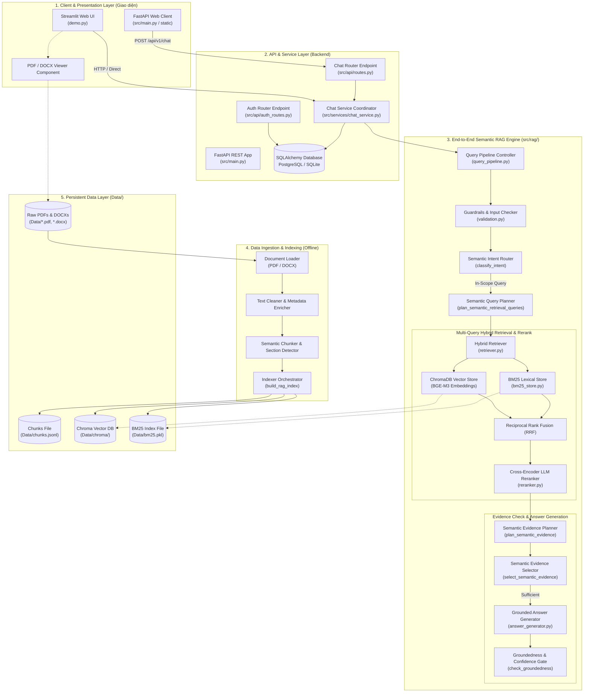
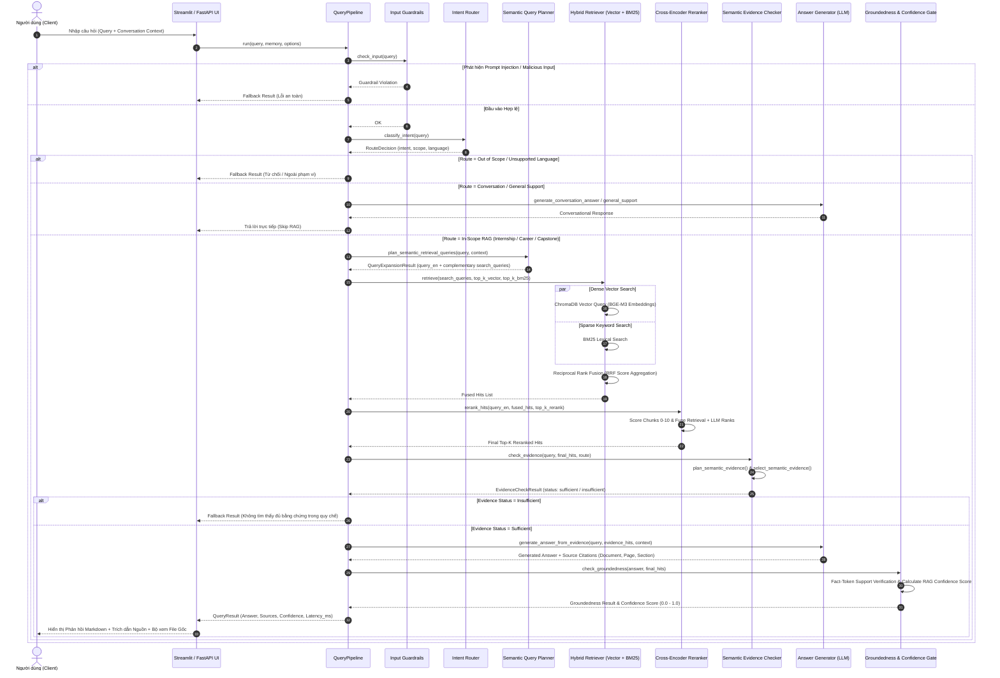
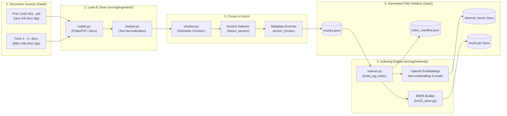

# 🎓 Internova AI — System Architecture & Data Flow Document

Tài liệu này tổng hợp toàn bộ **Sơ đồ Kiến trúc Thành phần (Component Architecture)** và **Sơ đồ Luồng Dữ liệu (Data Flow Diagram)** của Hệ thống VinUniversity Internship RAG Chatbot.

> 👁️ **File sơ đồ giao diện trực quan (Visual Interactive Diagram):** Bạn có thể mở trực tiếp tệp [docs/architecture_diagram.html](architecture_diagram.html) bằng bất kỳ trình duyệt web nào (Chrome, Edge, Firefox) để xem sơ đồ đồ họa tương tác tuyệt đẹp.

---

## 1. Sơ đồ Kiến trúc Thành phần Tổng quan (Component Architecture Diagram)

Hệ thống được thiết kế theo mô hình 5 tầng phân tách rõ ràng (5-Tier Architecture):

---

## 2. Sơ đồ Luồng Dữ liệu Xử lý Truy vấn (Query Execution Data Flow Sequence)

Sơ đồ trình tự chi tiết tương tác dữ liệu qua 10 bước trong `src/rag/query_pipeline.py`:

---

## 3. Sơ đồ Luồng Nạp và Đánh chỉ mục Dữ liệu Offline (Data Ingestion Data Flow)

---

## 4. Mô tả chi tiết các thành phần chính trong hệ thống

| Component | Vị trí File Code | Công nghệ sử dụng | Nhiệm vụ chính |
| :--- | :--- | :--- | :--- |
| **Streamlit UI** | [demo.py](file:///d:/BTL-VIN/P-103/demo.py) | Streamlit | Giao diện Chatbot tương tác trực quan, hỗ trợ stream câu trả lời, xem file PDF/DOCX trực tiếp. |
| **FastAPI Backend** | [src/main.py](file:///d:/BTL-VIN/P-103/src/main.py), [src/api/routes.py](file:///d:/BTL-VIN/P-103/src/api/routes.py) | FastAPI, Pydantic | REST API Server xử lý yêu cầu chat, quản lý phiên đăng nhập và tài liệu OpenAPI / Swagger. |
| **Query Pipeline** | [src/rag/query_pipeline.py](file:///d:/BTL-VIN/P-103/src/rag/query_pipeline.py) | Python, LangChain | Controller chính thực thi toàn bộ luồng RAG 10 bước từ nhận query đến kiểm định đầu ra. |
| **Semantic Query Planner** | [src/rag/prompts.py](file:///d:/BTL-VIN/P-103/src/rag/prompts.py) | OpenAI LLM | Lập kế hoạch truy vấn đa chiều (Multi-query expansion) và dịch thuật ngữ nghĩa VI-EN. |
| **Hybrid Retriever** | [src/rag/retrieval/retriever.py](file:///d:/BTL-VIN/P-103/src/rag/retrieval/retriever.py) | ChromaDB, BM25, RRF | Tìm kiếm kết hợp giữa Dense Vector Search (BGE-M3) và Sparse Search (BM25) với thuật toán RRF. |
| **Cross-Encoder Reranker** | [src/rag/retrieval/reranker.py](file:///d:/BTL-VIN/P-103/src/rag/retrieval/reranker.py) | LLM Reranker | Đánh giá điểm độ liên quan 0-10 và xếp hạng lại Top-K chunk phù hợp nhất cho ngữ cảnh. |
| **Evidence Checker** | [src/rag/evidence.py](file:///d:/BTL-VIN/P-103/src/rag/evidence.py) | Structured LLM | Lập kế hoạch bằng chứng và xác thực tính đầy đủ (`sufficient`/`insufficient`) trước khi trả lời. |
| **Groundedness Gate** | [src/rag/generation/validation.py](file:///d:/BTL-VIN/P-103/src/rag/generation/validation.py) | Fact-Token Checker | Kiểm định xem câu trả lời có căn cứ trong tài liệu hay không và tính toán điểm tin cậy `Confidence %`. |
