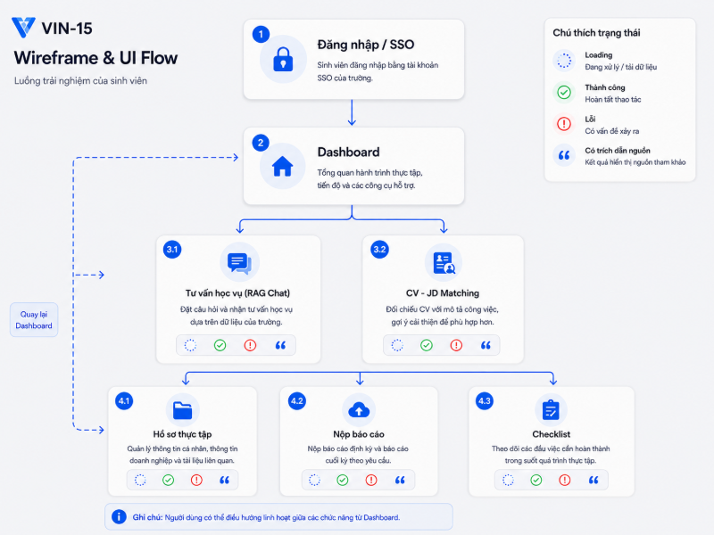
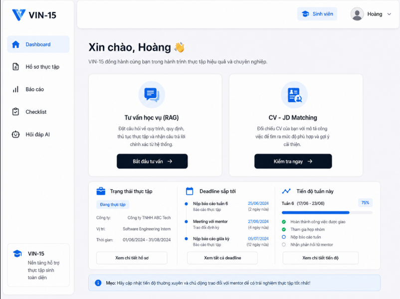
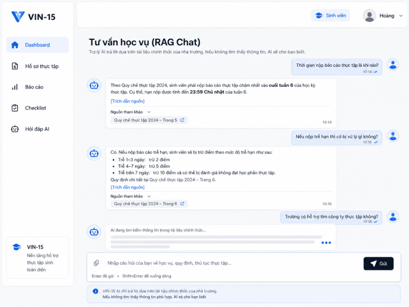
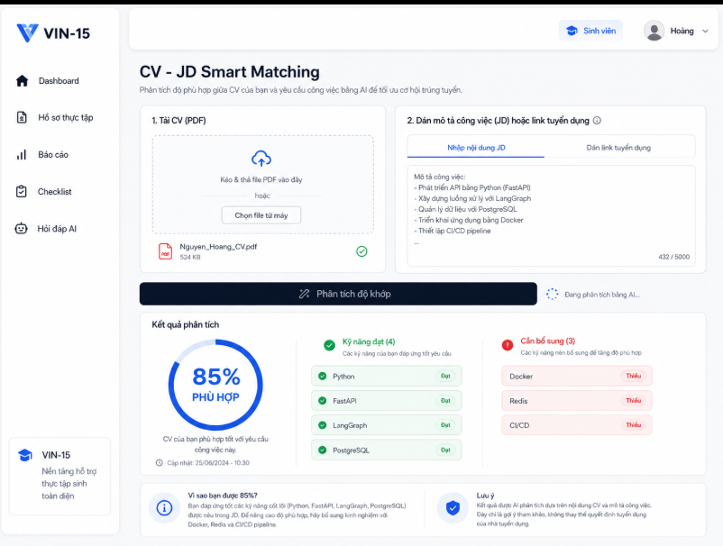

# BÁO CÁO GATE 1: CHỐT ĐỀ TÀI & THIẾT KẾ DỰ ÁN

**Tên dự án:** Nền tảng Hỗ trợ Thực tập thông minh tích hợp AI
**Thời gian nộp:** 02/08/2026
**Nhóm phát triển:** Vũ Huy Hoàng (Trưởng nhóm), Khánh, Tuấn Anh, Đức

---

# 1. 1-PAGE BRIEF – BẢN TÓM TẮT DỰ ÁN

## 1.1. Bối cảnh và vấn đề

Quá trình đăng ký, theo dõi và hoàn thành học phần thực tập hiện nay còn tồn tại nhiều hạn chế đối với cả sinh viên, giảng viên và cán bộ quản lý.

### 1.1.1. Thiếu nguồn thông tin tập trung

Các thông tin liên quan đến thực tập như quy chế, biểu mẫu, điều kiện đăng ký, thời hạn nộp báo cáo và quy trình phê duyệt thường được lưu trữ tại nhiều nguồn khác nhau. Sinh viên phải mất nhiều thời gian để tìm kiếm và kiểm tra thông tin, đồng thời có nguy cơ sử dụng nhầm tài liệu cũ hoặc tài liệu đã hết hiệu lực.

### 1.1.2. Quy trình đăng ký và theo dõi còn thủ công

Sinh viên phải tự nhập nhiều trường thông tin khi đăng ký thực tập. Giảng viên và cán bộ khoa cũng phải kiểm tra, phản hồi và theo dõi từng hồ sơ theo cách thủ công. Điều này có thể dẫn đến sai sót, thiếu thông tin và kéo dài thời gian xử lý hồ sơ.

### 1.1.3. Khó khăn trong việc tìm kiếm vị trí phù hợp

Sinh viên, đặc biệt là sinh viên chưa có nhiều kinh nghiệm, gặp khó khăn trong việc đánh giá mức độ phù hợp giữa năng lực cá nhân và yêu cầu của doanh nghiệp. Nhiều sinh viên chưa biết cách xác định kỹ năng còn thiếu hoặc lựa chọn vị trí thực tập phù hợp với ngành học và định hướng nghề nghiệp.

### 1.1.4. Chất lượng báo cáo chưa đồng đều

Một số sinh viên chưa nắm rõ cấu trúc và yêu cầu của báo cáo tuần, báo cáo giữa kỳ hoặc báo cáo cuối kỳ. Báo cáo có thể bị thiếu mục, trình bày chưa đúng biểu mẫu hoặc chưa đáp ứng rubric đánh giá, dẫn đến việc phải chỉnh sửa nhiều lần.

### 1.1.5. Thiếu cơ chế cảnh báo sớm

Giảng viên và cán bộ khoa chưa có công cụ tổng hợp để phát hiện sớm các sinh viên chưa đăng ký, thường xuyên nộp báo cáo trễ hoặc có nguy cơ không hoàn thành học phần. Phần lớn vấn đề chỉ được phát hiện khi đã gần hoặc quá thời hạn xử lý.

### 1.1.6. Quá tải cho giảng viên và cán bộ quản lý

Cán bộ phụ trách thực tập phải thường xuyên trả lời các câu hỏi lặp lại về thủ tục, biểu mẫu, thời hạn và quy định. Đồng thời, việc tổng hợp số liệu, kiểm tra hồ sơ và theo dõi tiến độ của nhiều sinh viên làm tăng đáng kể khối lượng công việc quản lý.

---

## 1.2. Giải pháp đề xuất

Nhóm đề xuất xây dựng **VIN-15 – Hệ thống hỗ trợ thực tập bằng trí tuệ nhân tạo**, một nền tảng web hỗ trợ quản lý toàn bộ quá trình thực tập của sinh viên.

Hệ thống kết hợp các chức năng quản lý nghiệp vụ với các mô-đun trí tuệ nhân tạo nhằm hỗ trợ sinh viên, giảng viên và cán bộ khoa trong quá trình đăng ký, theo dõi, đánh giá và hoàn thành học phần thực tập.

Giải pháp được tổ chức thành bốn nhóm chính.

### 1.2.1. Quản lý quy trình thực tập

Hệ thống số hóa các nghiệp vụ chính trong quá trình thực tập, bao gồm:

* Đăng ký học phần thực tập.
* Khai báo công ty, vị trí và mentor.
* Phê duyệt hoặc yêu cầu bổ sung hồ sơ.
* Nộp báo cáo tuần, giữa kỳ và cuối kỳ.
* Theo dõi trạng thái hồ sơ và tiến độ thực tập.
* Quản lý checklist hoàn thành học phần.
* Tự động quy đổi hoặc đề xuất quy đổi tín chỉ.
* Đồng bộ dữ liệu với LMS.

### 1.2.2. Trợ lý học vụ sử dụng RAG

Hệ thống cung cấp chatbot sử dụng kỹ thuật Retrieval-Augmented Generation, gọi tắt là RAG, để giải đáp các câu hỏi liên quan đến:

* Quy chế thực tập.
* Điều kiện đăng ký.
* Thủ tục thay đổi công ty hoặc mentor.
* Quy định nộp báo cáo.
* Biểu mẫu cần sử dụng.
* Quy trình hoàn thành học phần.

Câu trả lời của chatbot phải được tạo dựa trên tài liệu chính thức trong kho tri thức và kèm theo nguồn trích dẫn. Khi không tìm thấy thông tin phù hợp, hệ thống phải thông báo rõ thay vì tự tạo câu trả lời.

### 1.2.3. Hỗ trợ sinh viên bằng AI

Các chức năng AI hỗ trợ sinh viên bao gồm:

* Tự động trích xuất thông tin từ nội dung hội thoại và điền vào hồ sơ đăng ký.
* Phân tích hồ sơ, kỹ năng và ngành học của sinh viên.
* Đề xuất công ty hoặc vị trí thực tập phù hợp.
* So sánh năng lực của sinh viên với yêu cầu của vị trí thực tập.
* Phát hiện những kỹ năng sinh viên còn thiếu.
* Kiểm tra cấu trúc và nội dung báo cáo theo template và rubric.
* Gợi ý các nội dung cần bổ sung trước khi sinh viên nộp báo cáo.

Trong phạm vi mở rộng, hệ thống có thể bổ sung chức năng Mock Interview để sinh viên luyện tập phỏng vấn dựa trên CV và mô tả công việc.

### 1.2.4. Hỗ trợ giảng viên và cán bộ khoa

Hệ thống cung cấp các công cụ hỗ trợ quản lý như:

* Dashboard BI tổng hợp tình hình thực tập.
* Thống kê sinh viên đã đăng ký, chưa đăng ký và đang chờ phê duyệt.
* Theo dõi sinh viên có báo cáo trễ hạn.
* Phát hiện sớm sinh viên có nguy cơ chậm tiến độ.
* Gửi bản tổng hợp định kỳ qua email hoặc nền tảng giao tiếp nội bộ.
* Quản lý kho tri thức và các câu hỏi thường gặp.
* Theo dõi lịch sử xử lý, phê duyệt và thay đổi hồ sơ.

---

## 1.3. Giá trị của giải pháp

VIN-15 hướng đến việc mang lại các giá trị sau:

### Đối với sinh viên

* Tiếp cận thông tin thực tập nhanh chóng và chính xác.
* Giảm thời gian nhập và hoàn thiện hồ sơ.
* Theo dõi rõ ràng các nhiệm vụ và deadline cần hoàn thành.
* Nhận được gợi ý về vị trí thực tập phù hợp.
* Phát hiện sớm các phần còn thiếu trong báo cáo.
* Giảm nguy cơ nộp thiếu hồ sơ hoặc trễ thời hạn.

### Đối với giảng viên và cán bộ khoa

* Giảm số lượng câu hỏi thủ tục phải trả lời thủ công.
* Theo dõi tiến độ của nhiều sinh viên trên một hệ thống tập trung.
* Phát hiện sớm các trường hợp cần hỗ trợ.
* Chuẩn hóa quy trình phê duyệt và phản hồi hồ sơ.
* Giảm thời gian tổng hợp báo cáo và thống kê.
* Tăng tính minh bạch và khả năng truy vết.

### Đối với nhà trường

* Số hóa quy trình quản lý thực tập.
* Quản lý tập trung các tài liệu và quy chế.
* Tăng chất lượng dữ liệu phục vụ đánh giá và ra quyết định.
* Hỗ trợ cải tiến chương trình đào tạo dựa trên dữ liệu thực tế.
* Tạo nền tảng để mở rộng sang các học phần hoặc chương trình khác.

---

## 1.4. Kiến trúc hệ thống và công nghệ dự kiến

VIN-15 được xây dựng theo kiến trúc web kết hợp với các dịch vụ AI độc lập. Các thành phần nghiệp vụ và thành phần AI được tách biệt để thuận tiện cho việc phát triển, kiểm thử và mở rộng.

### 1.4.1. Kiến trúc tổng thể

Hệ thống bao gồm các thành phần chính:

1. **Frontend:** Cung cấp giao diện cho sinh viên, giảng viên, cán bộ khoa và quản trị viên.
2. **Backend API:** Xử lý logic nghiệp vụ, xác thực, phân quyền và giao tiếp với cơ sở dữ liệu.
3. **AI Service:** Thực hiện các tác vụ RAG, tự động điền hồ sơ, matching, review báo cáo và cảnh báo sớm.
4. **Relational Database:** Lưu trữ tài khoản, hồ sơ, báo cáo, trạng thái và dữ liệu nghiệp vụ.
5. **Vector Database:** Lưu embedding của tài liệu và hỗ trợ tìm kiếm ngữ nghĩa.
6. **File Storage:** Lưu trữ CV, báo cáo, biểu mẫu và tài liệu quy chế.
7. **Integration Service:** Đồng bộ dữ liệu với LMS, email hoặc các nền tảng bên ngoài.

### 1.4.2. Công nghệ dự kiến

#### Frontend

* Xây dựng giao diện web responsive.
* Hỗ trợ hiển thị trên máy tính và thiết bị di động.
* Cung cấp dashboard riêng cho sinh viên và cán bộ quản lý.
* Framework frontend được lựa chọn theo công nghệ triển khai thực tế của nhóm.

#### Backend và API

* **FastAPI:** Xây dựng RESTful API bằng Python.
* Hỗ trợ asynchronous programming cho các tác vụ cần xử lý đồng thời.
* Cung cấp API cho frontend và các mô-đun AI.
* Xử lý xác thực, phân quyền và logic nghiệp vụ.

#### Kiến trúc AI

* **LangChain:** Hỗ trợ xây dựng các pipeline sử dụng mô hình ngôn ngữ lớn.
* **LangGraph:** Quản lý luồng trạng thái đối với các tác vụ AI cần nhiều bước hoặc nhiều Agent.
* Multi-Agent chỉ được áp dụng cho các chức năng cần phối hợp nhiều tác vụ, thay vì sử dụng cho toàn bộ hệ thống.
* Các chức năng nghiệp vụ thông thường được xử lý trực tiếp bởi backend.

#### Mô hình ngôn ngữ lớn

Hệ thống có thể tích hợp một trong các mô hình sau tùy theo điều kiện triển khai:

* Mô hình của OpenAI.
* Mô hình Google Gemini.
* Mô hình mã nguồn mở hoặc mô hình được cung cấp qua OpenRouter.

Việc lựa chọn mô hình cần dựa trên:

* Chất lượng tiếng Việt.
* Chi phí sử dụng.
* Tốc độ phản hồi.
* Khả năng xử lý ngữ cảnh dài.
* Khả năng tích hợp API.
* Yêu cầu bảo vệ dữ liệu.

#### RAG và tìm kiếm

* Sử dụng kỹ thuật chunking để chia nhỏ tài liệu.
* Sử dụng embedding để chuyển đổi nội dung thành vector.
* Sử dụng FAISS hoặc ChromaDB để lưu trữ và tìm kiếm vector.
* Có thể kết hợp tìm kiếm từ khóa và tìm kiếm vector bằng Hybrid Search.
* Sử dụng metadata để lọc tài liệu theo phiên bản, ngày hiệu lực và loại tài liệu.
* Kết quả truy xuất được đưa vào LLM để tạo câu trả lời có căn cứ.

#### Cơ sở dữ liệu

* **MySQL:** Lưu trữ dữ liệu nghiệp vụ có cấu trúc như tài khoản, hồ sơ, báo cáo, trạng thái phê duyệt và deadline.
* **PostgreSQL:** PostgreSQL được lựa chọn vì có khả năng xử lý dữ liệu có cấu trúc tốt, hỗ trợ giao dịch, ràng buộc dữ liệu, truy vấn phức tạp và phù hợp với các hệ thống web được phát triển bằng Python và FastAPI.
* Trong trường hợp phạm vi dự án nhỏ, nhóm có thể chỉ sử dụng MySQL và lưu lịch sử hội thoại dưới dạng bảng để giảm độ phức tạp của hệ thống.

#### Lưu trữ file

* Lưu CV, báo cáo và tài liệu quy chế trên file storage.
* Cơ sở dữ liệu chỉ lưu đường dẫn, metadata và quyền truy cập của file.
* File tải lên phải được kiểm tra định dạng, dung lượng và quyền truy cập.

---

## 1.5. Nguyên tắc sử dụng AI

Các chức năng AI trong VIN-15 phải tuân theo các nguyên tắc sau:

* AI chỉ đóng vai trò hỗ trợ người dùng.
* AI không được tự động phê duyệt hồ sơ.
* AI không được tự động quyết định số tín chỉ chính thức.
* AI không được tự động cho điểm hoặc kết luận sinh viên không hoàn thành học phần.
* Các quyết định ảnh hưởng đến quyền lợi học tập phải được giảng viên hoặc cán bộ có thẩm quyền phê duyệt.
* Câu trả lời về quy chế phải có nguồn trích dẫn.
* AI phải thông báo khi không có đủ dữ liệu để trả lời.
* Nội dung do AI tạo phải được phân biệt với thông báo chính thức của nhà trường.
* Dữ liệu CV, báo cáo và hội thoại phải được bảo vệ.
* Các phiên bản mô hình, prompt và cấu hình retrieval phải được ghi nhận để phục vụ kiểm tra.

---

## 1.6. Phân công công việc

### Vũ Huy Hoàng – Trưởng nhóm / UI-UX Designer

Vũ Huy Hoàng chịu trách nhiệm quản lý và điều phối chung của dự án, theo dõi tiến độ và tổng hợp kết quả của nhóm. Đồng thời, Hoàng tham gia phân tích yêu cầu, đề xuất chức năng, wireframe, thiết kế luồng sử dụng, giao diện, các chức năng cho hệ thống, prototype và đảm bảo giao diện thống nhất, dễ sử dụng trên nhiều thiết bị.

### Khánh – UI-UX Designer

Khánh phối hợp với Hoàng trong việc thiết kế giao diện và trải nghiệm người dùng. Các công việc chính bao gồm xây dựng bố cục màn hình, giao diện, các chức năng của hệ thống, prototype và đảm bảo giao diện thống nhất, dễ sử dụng trên nhiều thiết bị.

### Tuấn Anh – AI / RAG Engineer / Data Engineer

Tuấn Anh chịu trách nhiệm phát triển các mô-đun AI hỗ trợ quản lý thực tập, bao gồm kiểm tra tính đầy đủ của hồ sơ và báo cáo, phát hiện sớm sinh viên có nguy cơ chậm tiến độ, đồng thời tham gia thu thập, chuẩn hóa dữ liệu và đánh giá chất lượng đầu ra của các mô-đun AI trước khi tích hợp vào hệ thống.

### Đức – AI Engineer / Data Engineer

Đức chịu trách nhiệm thu thập, làm sạch và chuẩn hóa các tài liệu liên quan đến quy trình thực tập. Đồng thời, Đức xây dựng kho tri thức và pipeline RAG, phát triển chatbot AI có khả năng truy xuất thông tin và trả lời câu hỏi của sinh viên dựa trên tài liệu chính thức, kèm theo trích dẫn nguồn nhằm đảm bảo tính chính xác và tin cậy của câu trả lời.

### Cơ chế phối hợp

Nhóm được chia thành hai bộ phận chính:

1. **Nhóm thiết kế giao diện:** Vũ Huy Hoàng và Khánh.
2. **Nhóm AI và dữ liệu:** Tuấn Anh và Đức.

Nhóm giao diện chịu trách nhiệm thiết kế các màn hình, luồng thao tác và cách hiển thị kết quả. Nhóm AI và dữ liệu chịu trách nhiệm xử lý dữ liệu, xây dựng các chức năng AI và cung cấp kết quả cho giao diện.

Các thành viên phối hợp với nhau để thống nhất dữ liệu đầu vào, dữ liệu đầu ra, cách tích hợp giữa giao diện và mô-đun AI, đồng thời kiểm thử và hoàn thiện sản phẩm.

## 1.7. Kết quả đầu ra dự kiến

Dự án hướng đến xây dựng một hệ thống có khả năng:

* Cho phép người dùng đăng ký và đăng nhập theo vai trò.
* Hỗ trợ sinh viên đăng ký học phần thực tập.
* Hỗ trợ quy trình phê duyệt hồ sơ.
* Theo dõi trạng thái và deadline trên dashboard.
* Hỗ trợ sinh viên nộp các loại báo cáo.
* Cung cấp chatbot RAG có nguồn trích dẫn.
* Hỗ trợ AI tự động điền hồ sơ.
* Gợi ý vị trí thực tập phù hợp.
* Review báo cáo theo template và rubric.
* Hiển thị dashboard tổng quan cho giảng viên và khoa.
* Cảnh báo sinh viên có nguy cơ chậm tiến độ.
* Quản lý và cập nhật kho tri thức.
* Lưu lịch sử thao tác để phục vụ kiểm tra và truy vết.

---

## 1.8. Phạm vi MVP

Do hệ thống có phạm vi tương đối lớn, phiên bản MVP nên ưu tiên các chức năng sau:

1. Đăng ký, đăng nhập và phân quyền người dùng.
2. Dashboard cá nhân của sinh viên.
3. Đăng ký học phần thực tập.
4. Workflow phê duyệt hồ sơ.
5. Nộp báo cáo tuần, giữa kỳ và cuối kỳ.
6. Checklist hoàn thành học phần.
7. Chatbot tư vấn quy chế sử dụng RAG.
8. Kho tri thức RAG.
9. Dashboard tổng quan cơ bản cho giảng viên và khoa.

Các chức năng AI nâng cao như matching vị trí, AI review báo cáo, cảnh báo sớm, quy đổi tín chỉ và Mock Interview có thể được phát triển sau khi nhóm hoàn thành các chức năng nghiệp vụ cốt lõi.

Việc giới hạn rõ phạm vi MVP giúp nhóm tập trung nguồn lực, đảm bảo sản phẩm có thể hoạt động hoàn chỉnh và tránh tình trạng xây dựng nhiều chức năng nhưng không có chức năng nào đạt chất lượng cần thiết.

# 2. PRD – TÀI LIỆU YÊU CẦU SẢN PHẨM

## 2.1. Tổng quan sản phẩm

### 2.1.1. Tên sản phẩm

**VIN-15 – Hệ thống hỗ trợ thực tập bằng trí tuệ nhân tạo**

### 2.1.2. Mục tiêu sản phẩm

VIN-15 được xây dựng nhằm số hóa và tối ưu hóa toàn bộ quy trình thực tập của sinh viên, từ giai đoạn đăng ký học phần, tìm kiếm vị trí thực tập, theo dõi tiến độ, nộp báo cáo đến khi hoàn tất học phần.

Hệ thống ứng dụng trí tuệ nhân tạo nhằm:

* Hỗ trợ sinh viên hoàn thiện hồ sơ đăng ký thực tập.
* Gợi ý vị trí thực tập phù hợp với chuyên ngành và kỹ năng.
* Giải đáp các câu hỏi về quy chế, thủ tục và chính sách thực tập.
* Kiểm tra chất lượng báo cáo trước khi sinh viên nộp.
* Phát hiện sớm sinh viên có nguy cơ chậm tiến độ hoặc không hoàn thành học phần.
* Hỗ trợ giảng viên và khoa theo dõi, phê duyệt và quản lý hoạt động thực tập tập trung.
* Giảm khối lượng công việc thủ công cho cán bộ quản lý và giảng viên.
* Tăng tính minh bạch và khả năng truy vết trong quá trình xử lý hồ sơ.

### 2.1.3. Phạm vi hệ thống

Hệ thống bao gồm ba nhóm chức năng chính:

1. Nhóm chức năng dành cho sinh viên.
2. Nhóm chức năng dành cho giảng viên và khoa.
3. Nhóm chức năng nền tảng, tích hợp và quản trị dữ liệu.

### 2.1.4. Đối tượng sử dụng

| Đối tượng             | Vai trò                                                                                |
| ------------------------- | --------------------------------------------------------------------------------------- |
| Sinh viên                | Đăng ký thực tập, tìm vị trí phù hợp, nộp báo cáo và theo dõi tiến độ |
| Giảng viên hướng dẫn | Theo dõi, nhận xét và đánh giá quá trình thực tập                            |
| Cán bộ khoa             | Phê duyệt hồ sơ, quản lý học phần và theo dõi dữ liệu tổng quan            |
| Quản trị viên          | Quản lý tài khoản, phân quyền, kho tri thức và cấu hình hệ thống            |
| Mentor doanh nghiệp      | Xác nhận thông tin và cung cấp đánh giá nếu được cấp quyền                |

---

## 2.2. Phân loại dữ liệu đầu vào

Hệ thống xử lý năm nhóm dữ liệu chính.

### 2.2.1. Knowledge Data – Dữ liệu tri thức

Knowledge Data là nhóm dữ liệu được sử dụng cho hệ thống Retrieval-Augmented Generation, gọi tắt là RAG, và các chức năng tư vấn bằng trí tuệ nhân tạo.

Dữ liệu bao gồm:

* Quy chế thực tập của nhà trường.
* Quy định đăng ký học phần thực tập.
* Hướng dẫn quy đổi tín chỉ.
* Biểu mẫu đăng ký thực tập.
* Mẫu báo cáo tuần.
* Mẫu báo cáo giữa kỳ.
* Mẫu báo cáo cuối kỳ.
* Rubric chấm điểm thực tập.
* Các câu hỏi thường gặp.
* Các tình huống thực tế và cách xử lý đã được khoa phê duyệt.
* Quy trình thay đổi công ty, mentor hoặc vị trí thực tập.
* Các thông báo và chính sách liên quan đến học phần thực tập.

Mỗi tài liệu cần có các metadata tối thiểu sau:

* Tên tài liệu.
* Loại tài liệu.
* Đơn vị ban hành.
* Ngày ban hành.
* Ngày có hiệu lực.
* Phiên bản.
* Trạng thái hiệu lực.
* Quyền truy cập.
* Người cập nhật.
* Thời gian cập nhật gần nhất.

### 2.2.2. Master Data – Dữ liệu danh mục

Master Data là dữ liệu nền tảng được sử dụng chung trong toàn hệ thống.

Dữ liệu bao gồm:

* Danh sách sinh viên.
* Danh sách giảng viên.
* Danh sách khoa và ngành học.
* Danh sách lớp và khóa học.
* Danh sách học phần.
* Danh sách doanh nghiệp.
* Danh sách vị trí thực tập.
* Danh mục kỹ năng.
* Danh mục loại báo cáo.
* Danh sách học kỳ và năm học.
* Danh sách trạng thái hồ sơ.
* Danh sách vai trò và quyền hạn trong hệ thống.

### 2.2.3. Operational Data – Dữ liệu nghiệp vụ

Operational Data là dữ liệu phát sinh trong quá trình vận hành hệ thống.

Dữ liệu bao gồm:

* Hồ sơ đăng ký thực tập.
* Thông tin công ty và mentor.
* Thời gian bắt đầu và kết thúc thực tập.
* Vị trí thực tập.
* Mô tả công việc.
* Báo cáo tuần.
* Báo cáo giữa kỳ.
* Báo cáo cuối kỳ.
* Nhận xét của giảng viên.
* Đánh giá của mentor doanh nghiệp.
* Lịch sử phê duyệt hồ sơ.
* Deadline của từng sinh viên.
* Trạng thái hoàn thành checklist.
* Kết quả quy đổi tín chỉ.
* Cảnh báo tiến độ.
* Lịch sử gửi thông báo.
* Lịch sử chỉnh sửa hồ sơ và báo cáo.

### 2.2.4. AI Contextual Data – Dữ liệu ngữ cảnh AI

AI Contextual Data là dữ liệu được sử dụng để duy trì ngữ cảnh và đánh giá chất lượng các chức năng AI.

Dữ liệu bao gồm:

* Nội dung hội thoại giữa sinh viên và chatbot.
* Lịch sử câu hỏi và câu trả lời.
* Các tài liệu được truy xuất trong từng câu trả lời.
* Prompt được gửi đến mô hình AI.
* Phản hồi được tạo bởi mô hình AI.
* Điểm tin cậy của kết quả AI.
* Lịch sử sinh viên chỉnh sửa thông tin do AI đề xuất.
* Phản hồi đúng hoặc sai từ người dùng.
* Session logs phục vụ duy trì ngữ cảnh hội thoại.
* Phiên bản mô hình AI được sử dụng.
* Cấu hình retrieval và prompt tương ứng.

Dữ liệu hội thoại phải có thời hạn lưu trữ rõ ràng và tuân thủ các chính sách bảo vệ dữ liệu cá nhân.

### 2.2.5. Integration Data – Dữ liệu tích hợp

Integration Data là dữ liệu được đồng bộ từ các hệ thống bên ngoài.

Dữ liệu bao gồm:

* Tài khoản email trường.
* Thông tin sinh viên từ LMS hoặc Student Information System.
* Kết quả học tập.
* Số tín chỉ đã tích lũy.
* Điều kiện tiên quyết của học phần.
* Danh sách sinh viên đăng ký học phần.
* Danh sách giảng viên phụ trách.
* Email và thông báo từ hệ thống.
* Dữ liệu gửi sang Slack hoặc Microsoft Teams nếu được tích hợp.

---

## 2.3. Yêu cầu chức năng

### 2.3.1. Nhóm chức năng dành cho sinh viên

---

## Feature 1: Dashboard cá nhân

### Mô tả

Dashboard cá nhân cung cấp cho sinh viên cái nhìn tổng quan về trạng thái thực tập, tiến độ hoàn thành, các báo cáo đã nộp và những deadline sắp tới.

### User Story

Là một sinh viên đang tham gia thực tập, tôi muốn xem toàn bộ trạng thái hồ sơ, tiến độ báo cáo và deadline tại một màn hình để biết công việc nào đã hoàn thành và công việc nào cần thực hiện tiếp theo.

### Functional Requirements

* **FR-STU-01.1:** Hệ thống phải hiển thị trạng thái đăng ký thực tập hiện tại của sinh viên.
* **FR-STU-01.2:** Hệ thống phải hiển thị tên công ty, vị trí, mentor và thời gian thực tập.
* **FR-STU-01.3:** Hệ thống phải hiển thị tiến độ thực tập theo tuần.
* **FR-STU-01.4:** Hệ thống phải hiển thị danh sách báo cáo đã nộp, chưa nộp và bị yêu cầu chỉnh sửa.
* **FR-STU-01.5:** Hệ thống phải hiển thị các deadline sắp tới theo thứ tự thời gian.
* **FR-STU-01.6:** Hệ thống phải cho phép sinh viên truy cập nhanh đến công việc cần xử lý.
* **FR-STU-01.7:** Hệ thống phải hiển thị cảnh báo khi sinh viên có nhiệm vụ quá hạn.
* **FR-STU-01.8:** Hệ thống phải hiển thị tỷ lệ hoàn thành học phần thực tập.
* **FR-STU-01.9:** Hệ thống phải hiển thị các thông báo mới từ giảng viên hoặc khoa.

### Acceptance Criteria

* Sinh viên chỉ được xem dữ liệu thuộc hồ sơ của mình.
* Trạng thái trên dashboard phải đồng bộ với trạng thái thực tế của hồ sơ.
* Deadline quá hạn phải được hiển thị nổi bật.
* Sau khi sinh viên nộp báo cáo, trạng thái dashboard phải được cập nhật không quá 10 giây.
* Các công việc cần xử lý phải có liên kết dẫn đến chức năng tương ứng.
* Thời gian tải dashboard không vượt quá 3 giây đối với 95% lượt truy cập trong điều kiện vận hành bình thường.

---

## Feature 2: Đăng ký học phần thực tập

### Mô tả

Chức năng cho phép sinh viên khai báo thông tin thực tập và gửi hồ sơ đến khoa để phê duyệt.

### User Story

Là một sinh viên đã tìm được nơi thực tập, tôi muốn khai báo thông tin công ty, mentor, vị trí và thời gian thực tập để gửi hồ sơ đăng ký đến khoa.

### Functional Requirements

* **FR-STU-02.1:** Hệ thống phải cung cấp form đăng ký học phần thực tập.
* **FR-STU-02.2:** Sinh viên phải khai báo tên công ty, địa chỉ công ty, vị trí thực tập và mô tả công việc.
* **FR-STU-02.3:** Sinh viên phải khai báo thông tin mentor doanh nghiệp.
* **FR-STU-02.4:** Sinh viên phải khai báo thời gian bắt đầu và kết thúc thực tập.
* **FR-STU-02.5:** Hệ thống phải cho phép tải lên các tài liệu bắt buộc.
* **FR-STU-02.6:** Hệ thống phải kiểm tra các trường bắt buộc trước khi gửi hồ sơ.
* **FR-STU-02.7:** Sinh viên phải có khả năng lưu hồ sơ dưới dạng bản nháp.
* **FR-STU-02.8:** Sinh viên phải xem được trạng thái xét duyệt và phản hồi của khoa.
* **FR-STU-02.9:** Hệ thống phải lưu lịch sử chỉnh sửa và phê duyệt hồ sơ.
* **FR-STU-02.10:** Hệ thống phải cho phép sinh viên gửi yêu cầu thay đổi thông tin sau khi hồ sơ đã được phê duyệt.
* **FR-STU-02.11:** Hệ thống phải kiểm tra điều kiện tiên quyết trước khi cho phép sinh viên gửi hồ sơ.

### Acceptance Criteria

* Không cho phép gửi hồ sơ khi thiếu trường bắt buộc.
* Ngày kết thúc thực tập phải lớn hơn ngày bắt đầu.
* Email mentor phải đúng định dạng.
* Sinh viên có thể lưu và tiếp tục chỉnh sửa hồ sơ nháp.
* Sau khi hồ sơ được gửi, hệ thống phải ghi nhận chính xác thời gian gửi.
* Nếu hồ sơ bị yêu cầu bổ sung, sinh viên phải nhìn thấy nội dung cần chỉnh sửa.
* Sinh viên không được chỉnh sửa trực tiếp hồ sơ đã được phê duyệt nếu chưa có yêu cầu thay đổi.
* Hệ thống phải thông báo rõ nếu sinh viên chưa đáp ứng điều kiện tiên quyết.

---

## Feature 3: AI tự điền hồ sơ

### Mô tả

Sinh viên mô tả thông tin thực tập bằng ngôn ngữ tự nhiên. AI phân tích nội dung và tự động điền các trường tương ứng vào form đăng ký.

### User Story

Là một sinh viên, tôi muốn mô tả thông tin thực tập bằng lời thay vì nhập từng trường để hoàn thành hồ sơ đăng ký nhanh hơn.

### Functional Requirements

* **FR-STU-03.1:** Hệ thống phải cung cấp giao diện chat để sinh viên mô tả thông tin thực tập.
* **FR-STU-03.2:** AI phải trích xuất tên công ty, vị trí, thời gian, mentor và mô tả công việc.
* **FR-STU-03.3:** Hệ thống phải tự động điền các thông tin đã trích xuất vào form.
* **FR-STU-03.4:** Các trường không xác định được phải để trống hoặc được đánh dấu là cần xác nhận.
* **FR-STU-03.5:** Hệ thống phải cho phép sinh viên chỉnh sửa toàn bộ thông tin do AI đề xuất.
* **FR-STU-03.6:** AI không được tự động gửi hồ sơ khi chưa có xác nhận của sinh viên.
* **FR-STU-03.7:** Hệ thống phải hiển thị mức độ tin cậy đối với các trường thông tin quan trọng.
* **FR-STU-03.8:** AI phải đặt câu hỏi bổ sung khi thông tin sinh viên cung cấp chưa đầy đủ.
* **FR-STU-03.9:** Hệ thống phải lưu lại nội dung gốc mà sinh viên đã mô tả để đối chiếu.

### Acceptance Criteria

* AI phải điền đúng các trường được đề cập rõ ràng trong nội dung của sinh viên.
* Thông tin do AI suy luận phải được đánh dấu để người dùng kiểm tra.
* Sinh viên phải xác nhận trước khi thông tin được lưu chính thức.
* AI không được tự tạo tên công ty, mentor hoặc thời gian nếu dữ liệu không được cung cấp.
* Khi không xác định được thông tin, hệ thống phải yêu cầu bổ sung thay vì tự suy diễn.
* Kết quả AI phải được hiển thị để sinh viên kiểm tra trước khi đưa vào form.
* Sinh viên có thể sửa hoặc xóa toàn bộ nội dung do AI điền.
* Hệ thống không được tự động nộp hồ sơ thay cho sinh viên.

---

## Feature 4: Gợi ý matching vị trí thực tập

### Mô tả

AI phân tích ngành học, kỹ năng, kinh nghiệm và mục tiêu nghề nghiệp của sinh viên để đề xuất các vị trí thực tập phù hợp.

### User Story

Là một sinh viên chưa tìm được nơi thực tập, tôi muốn nhận danh sách các vị trí phù hợp với chuyên ngành và kỹ năng để lựa chọn cơ hội có khả năng đáp ứng cao nhất.

### Functional Requirements

* **FR-STU-04.1:** Hệ thống phải thu thập thông tin ngành học, kỹ năng và sở thích nghề nghiệp của sinh viên.
* **FR-STU-04.2:** Hệ thống phải cho phép sinh viên tải lên CV định dạng PDF hoặc DOCX.
* **FR-STU-04.3:** Hệ thống phải trích xuất kỹ năng, kinh nghiệm và học vấn từ CV.
* **FR-STU-04.4:** Hệ thống phải phân tích yêu cầu từ mô tả công việc.
* **FR-STU-04.5:** Hệ thống phải tính điểm phù hợp giữa sinh viên và vị trí thực tập.
* **FR-STU-04.6:** Hệ thống phải giải thích lý do đề xuất.
* **FR-STU-04.7:** Hệ thống phải chỉ ra những kỹ năng sinh viên còn thiếu.
* **FR-STU-04.8:** Sinh viên phải có khả năng lọc theo công ty, vị trí, kỹ năng và thời gian.
* **FR-STU-04.9:** Hệ thống phải cho phép sinh viên lưu vị trí quan tâm.
* **FR-STU-04.10:** Hệ thống phải cho phép sinh viên cập nhật hồ sơ kỹ năng.
* **FR-STU-04.11:** Hệ thống phải hiển thị ngày cập nhật gần nhất của thông tin tuyển dụng.

### Acceptance Criteria

* Hệ thống phải hỗ trợ CV ở định dạng PDF và DOCX.
* Hệ thống phải bóc tách tối thiểu ba nhóm thông tin gồm kỹ năng, kinh nghiệm và học vấn.
* Mỗi vị trí được đề xuất phải có Matching Score.
* Matching Score phải nằm trong khoảng từ 0 đến 100%.
* Kết quả phải hiển thị các kỹ năng phù hợp và kỹ năng còn thiếu.
* Hệ thống phải giải thích được các yếu tố chính tạo nên Matching Score.
* Kết quả AI chỉ mang tính đề xuất và không được sử dụng để tự động loại sinh viên.
* Hệ thống phải thông báo khi CV không thể đọc hoặc thiếu thông tin.
* Các vị trí đã hết hạn không được ưu tiên trong danh sách đề xuất.

---

## Feature 5: Chatbot hỏi đáp quy chế sử dụng RAG

### Mô tả

Chatbot giải đáp các câu hỏi liên quan đến quy chế, thủ tục, thời gian, biểu mẫu và chính sách thực tập dựa trên kho tri thức đã được khoa phê duyệt.

### User Story

Là một sinh viên, tôi muốn hỏi chatbot về điều kiện đăng ký, quy định nộp báo cáo và thủ tục thay đổi công ty để nhận được câu trả lời nhanh, chính xác và có nguồn tham khảo.

### Functional Requirements

* **FR-STU-05.1:** Hệ thống phải cho phép sinh viên đặt câu hỏi bằng ngôn ngữ tự nhiên.
* **FR-STU-05.2:** Hệ thống phải tìm kiếm nội dung liên quan trong kho tri thức.
* **FR-STU-05.3:** Câu trả lời phải được tạo dựa trên tài liệu truy xuất được.
* **FR-STU-05.4:** Hệ thống phải hiển thị nguồn trích dẫn.
* **FR-STU-05.5:** Nguồn trích dẫn phải bao gồm tên tài liệu và vị trí nội dung nếu có.
* **FR-STU-05.6:** Chatbot phải duy trì ngữ cảnh trong cùng một phiên hội thoại.
* **FR-STU-05.7:** Người dùng phải có khả năng đánh giá câu trả lời hữu ích hoặc không hữu ích.
* **FR-STU-05.8:** Câu hỏi chưa có câu trả lời phải được ghi nhận để quản trị viên bổ sung FAQ.
* **FR-STU-05.9:** Hệ thống phải cho phép người dùng mở tài liệu nguồn được trích dẫn.
* **FR-STU-05.10:** Hệ thống phải ưu tiên tài liệu còn hiệu lực và có phiên bản mới nhất.
* **FR-STU-05.11:** Hệ thống phải lưu lịch sử hội thoại trong thời gian được cấu hình.

### Acceptance Criteria

* Mọi câu trả lời liên quan đến quy chế phải có ít nhất một nguồn trích dẫn.
* Khi không có đủ thông tin, chatbot phải trả lời rằng không tìm thấy thông tin phù hợp trong tài liệu hiện có.
* Chatbot không được tự tạo quy định hoặc deadline không tồn tại.
* Người dùng phải có thể mở hoặc xem tài liệu nguồn được trích dẫn.
* Hệ thống phải ưu tiên tài liệu đang còn hiệu lực.
* Tài liệu hết hiệu lực không được sử dụng nếu đã có phiên bản thay thế.
* Thời gian xuất hiện token phản hồi đầu tiên không vượt quá 8 giây đối với 95% yêu cầu.
* Thời gian hoàn thành câu trả lời thông thường không vượt quá 16 giây đối với 95% yêu cầu.
* Chất lượng chatbot phải được đánh giá bằng bộ câu hỏi chuẩn do khoa hoặc nhóm dự án phê duyệt.
* Khi nguồn tài liệu có nội dung mâu thuẫn, chatbot phải thông báo cho người dùng thay vì tự lựa chọn một kết luận không có căn cứ.

> Yêu cầu toàn bộ câu trả lời hoàn thành dưới 8 giây có thể không phù hợp với hệ thống RAG và mô hình ngôn ngữ lớn. Do đó, hệ thống sử dụng tiêu chí dưới 8 giây cho thời gian bắt đầu phản hồi và dưới 16 giây cho câu trả lời hoàn chỉnh.

---

## Feature 6: Nộp báo cáo tuần, giữa kỳ và cuối kỳ

### Mô tả

Chức năng cho phép sinh viên nộp các loại báo cáo theo đúng biểu mẫu và thời hạn được quy định.

### User Story

Là một sinh viên đang thực tập, tôi muốn nộp báo cáo tuần, giữa kỳ và cuối kỳ trực tuyến để giảng viên theo dõi và đánh giá tiến độ của tôi.

### Functional Requirements

* **FR-STU-06.1:** Hệ thống phải hiển thị danh sách báo cáo cần nộp.
* **FR-STU-06.2:** Mỗi báo cáo phải có template tương ứng.
* **FR-STU-06.3:** Sinh viên phải có thể nhập nội dung trực tiếp hoặc tải file lên.
* **FR-STU-06.4:** Hệ thống phải ghi nhận thời gian nộp.
* **FR-STU-06.5:** Hệ thống phải xác định báo cáo được nộp đúng hạn hoặc trễ hạn.
* **FR-STU-06.6:** Sinh viên phải xem được nhận xét của giảng viên.
* **FR-STU-06.7:** Hệ thống phải hỗ trợ nộp lại khi giảng viên yêu cầu chỉnh sửa.
* **FR-STU-06.8:** Hệ thống phải lưu các phiên bản báo cáo.
* **FR-STU-06.9:** Hệ thống phải gửi thông báo xác nhận sau khi nộp thành công.
* **FR-STU-06.10:** Hệ thống phải cho phép sinh viên xem trước file trước khi nộp.
* **FR-STU-06.11:** Hệ thống phải kiểm tra định dạng và dung lượng file.

### Acceptance Criteria

* Sinh viên chỉ được nộp đúng loại báo cáo được yêu cầu.
* File tải lên phải đúng định dạng và giới hạn dung lượng.
* Hệ thống phải ghi nhận chính xác thời điểm nộp.
* Báo cáo nộp sau deadline phải được đánh dấu trễ hạn.
* Các phiên bản cũ không được ghi đè hoặc mất khỏi lịch sử.
* Sinh viên phải nhận được thông báo sau khi nộp thành công.
* Giảng viên phải xem được phiên bản mới nhất và lịch sử các phiên bản trước đó.
* Khi file tải lên bị lỗi, hệ thống phải thông báo rõ nguyên nhân.

---

## Feature 7: AI review báo cáo

### Mô tả

AI kiểm tra báo cáo theo template và rubric, phát hiện nội dung còn thiếu và đề xuất các điểm cần bổ sung.

### User Story

Là một sinh viên, tôi muốn AI kiểm tra báo cáo trước khi nộp chính thức để biết báo cáo còn thiếu mục nào hoặc cần cải thiện nội dung nào.

### Functional Requirements

* **FR-STU-07.1:** Hệ thống phải đọc nội dung báo cáo của sinh viên.
* **FR-STU-07.2:** Hệ thống phải xác định các phần bắt buộc theo template.
* **FR-STU-07.3:** Hệ thống phải phát hiện phần bị thiếu hoặc nội dung quá ngắn.
* **FR-STU-07.4:** AI phải đưa ra gợi ý bổ sung theo từng mục.
* **FR-STU-07.5:** Hệ thống phải kiểm tra báo cáo dựa trên rubric tương ứng.
* **FR-STU-07.6:** Hệ thống phải phân biệt giữa lỗi bắt buộc và đề xuất cải thiện.
* **FR-STU-07.7:** Sinh viên phải có thể bỏ qua đề xuất và tiếp tục nộp nếu không vi phạm yêu cầu bắt buộc.
* **FR-STU-07.8:** AI không được tự động sửa nội dung nếu chưa có sự đồng ý của sinh viên.
* **FR-STU-07.9:** Hệ thống phải hiển thị kết quả review theo từng phần của báo cáo.
* **FR-STU-07.10:** Hệ thống phải cho phép sinh viên chạy lại quá trình review sau khi chỉnh sửa.

### Acceptance Criteria

* Hệ thống phải phát hiện được các tiêu đề hoặc phần bắt buộc bị thiếu.
* Mỗi cảnh báo phải chỉ rõ vị trí hoặc phần cần chỉnh sửa.
* Gợi ý phải liên quan đến rubric và nội dung báo cáo.
* AI không được tự tạo số liệu, hoạt động hoặc kết quả thực tập cho sinh viên.
* Hệ thống phải thông báo rõ rằng kết quả AI chỉ là gợi ý.
* Báo cáo chỉ bị chặn nộp khi thiếu thành phần bắt buộc, không bị chặn vì sinh viên không làm theo gợi ý của AI.
* Kết quả review phải phân biệt rõ lỗi nghiêm trọng, cảnh báo và đề xuất.
* Sinh viên phải có thể xem lại kết quả review trước đó.
* AI không được tự động cho điểm chính thức đối với báo cáo.

---

## Feature 8: Checklist hoàn thành học phần thực tập

### Mô tả

Chức năng theo dõi các nhiệm vụ sinh viên cần hoàn thành trước khi kết thúc học phần thực tập.

### User Story

Là một sinh viên sắp hoàn thành kỳ thực tập, tôi muốn xem checklist các yêu cầu còn thiếu để đảm bảo mình đủ điều kiện hoàn tất học phần.

### Functional Requirements

* **FR-STU-08.1:** Hệ thống phải tạo checklist phù hợp với từng học phần.
* **FR-STU-08.2:** Checklist phải bao gồm hồ sơ, báo cáo, đánh giá và các tài liệu bắt buộc.
* **FR-STU-08.3:** Hệ thống phải tự động cập nhật trạng thái khi sinh viên hoàn thành nhiệm vụ.
* **FR-STU-08.4:** Sinh viên phải xem được nhiệm vụ nào chưa hoàn thành.
* **FR-STU-08.5:** Hệ thống phải hiển thị deadline của từng nhiệm vụ.
* **FR-STU-08.6:** Hệ thống phải cảnh báo trước khi một nhiệm vụ đến hạn.
* **FR-STU-08.7:** Checklist phải phản ánh đúng quy định của học kỳ hiện tại.
* **FR-STU-08.8:** Hệ thống phải hiển thị lý do một nhiệm vụ chưa được công nhận hoàn thành.
* **FR-STU-08.9:** Hệ thống phải cho phép sinh viên truy cập trực tiếp đến chức năng tương ứng từ checklist.

### Acceptance Criteria

* Mỗi mục checklist phải có trạng thái chưa thực hiện, đang xử lý hoặc hoàn thành.
* Hệ thống không được đánh dấu hoàn thành nếu tài liệu chưa được nộp hoặc chưa được duyệt.
* Sinh viên phải xem được lý do một nhiệm vụ chưa được công nhận hoàn thành.
* Checklist phải được cập nhật sau khi trạng thái hồ sơ hoặc báo cáo thay đổi.
* Deadline trên checklist phải khớp với deadline chính thức của học phần.
* Sinh viên phải nhận được cảnh báo trước các deadline quan trọng.

---

### 2.3.2. Nhóm chức năng dành cho giảng viên và khoa

## Feature 9: Dashboard BI tổng quan

### Mô tả

Dashboard BI cung cấp dữ liệu tổng quan về tình hình thực tập của toàn bộ sinh viên thuộc phạm vi quản lý.

### User Story

Là cán bộ khoa, tôi muốn xem số lượng sinh viên đang thực tập, chưa đăng ký, trễ hạn và có nguy cơ không hoàn thành để đưa ra hành động hỗ trợ kịp thời.

### Functional Requirements

* **FR-FAC-09.1:** Hệ thống phải thống kê số sinh viên theo trạng thái.
* **FR-FAC-09.2:** Hệ thống phải hiển thị số sinh viên chưa đăng ký thực tập.
* **FR-FAC-09.3:** Hệ thống phải hiển thị số sinh viên có báo cáo quá hạn.
* **FR-FAC-09.4:** Hệ thống phải hỗ trợ lọc theo ngành, lớp, khóa, học kỳ và giảng viên.
* **FR-FAC-09.5:** Hệ thống phải hiển thị biểu đồ xu hướng.
* **FR-FAC-09.6:** Người dùng có quyền phải xuất được báo cáo tổng hợp.
* **FR-FAC-09.7:** Người dùng phải có thể truy cập từ số liệu tổng quan đến danh sách sinh viên tương ứng.
* **FR-FAC-09.8:** Hệ thống phải hiển thị số sinh viên theo công ty và vị trí thực tập.
* **FR-FAC-09.9:** Hệ thống phải hiển thị thời gian dữ liệu được cập nhật gần nhất.
* **FR-FAC-09.10:** Hệ thống phải hỗ trợ so sánh dữ liệu giữa các học kỳ.

### Acceptance Criteria

* Số liệu tổng hợp phải khớp với dữ liệu hồ sơ chi tiết.
* Bộ lọc phải được áp dụng đồng thời trên toàn dashboard.
* Chỉ người có quyền mới được xem dữ liệu toàn khoa.
* File xuất phải phản ánh đúng bộ lọc đang sử dụng.
* Dashboard phải hiển thị thời điểm dữ liệu được cập nhật gần nhất.
* Khi người dùng chọn một chỉ số, hệ thống phải hiển thị danh sách sinh viên tương ứng.
* Dữ liệu nhạy cảm phải được ẩn đối với người không có quyền truy cập.

---

## Feature 10: Cảnh báo sớm

### Mô tả

AI phân tích tiến độ, lịch sử nộp báo cáo và các yếu tố liên quan để phát hiện sinh viên có nguy cơ trễ hạn hoặc không hoàn thành học phần.

### User Story

Là giảng viên phụ trách, tôi muốn được cảnh báo sớm về những sinh viên có dấu hiệu chậm tiến độ để liên hệ và hỗ trợ trước khi vấn đề trở nên nghiêm trọng.

### Functional Requirements

* **FR-FAC-10.1:** Hệ thống phải phân tích tình trạng đăng ký và tiến độ báo cáo.
* **FR-FAC-10.2:** Hệ thống phải xem xét số lần sinh viên trễ deadline.
* **FR-FAC-10.3:** Hệ thống phải phân loại mức độ rủi ro.
* **FR-FAC-10.4:** Mỗi cảnh báo phải có lý do.
* **FR-FAC-10.5:** Giảng viên phải có khả năng xác nhận, bỏ qua hoặc thêm ghi chú cho cảnh báo.
* **FR-FAC-10.6:** Hệ thống phải lưu lịch sử cảnh báo.
* **FR-FAC-10.7:** Hệ thống phải cho phép cấu hình các quy tắc cảnh báo.
* **FR-FAC-10.8:** Cảnh báo AI không được tự động thay đổi điểm hoặc trạng thái học tập của sinh viên.
* **FR-FAC-10.9:** Hệ thống phải cho phép giảng viên đánh dấu cảnh báo là đã xử lý.
* **FR-FAC-10.10:** Hệ thống phải hiển thị các yếu tố được sử dụng để tạo cảnh báo.

### Acceptance Criteria

* Mỗi sinh viên bị cảnh báo phải có ít nhất một nguyên nhân cụ thể.
* Hệ thống phải phân biệt mức rủi ro thấp, trung bình và cao.
* Giảng viên phải xem được dữ liệu dùng để tạo cảnh báo.
* Kết quả AI chỉ phục vụ hỗ trợ ra quyết định.
* Không được sử dụng các thuộc tính nhạy cảm không liên quan để đánh giá rủi ro.
* Mô hình phải được đánh giá trên dữ liệu lịch sử đã ẩn danh trước khi triển khai.
* Các cảnh báo sai phải có cơ chế ghi nhận để cải thiện hệ thống.
* AI không được tự động kết luận sinh viên sẽ trượt học phần.
* Việc thay đổi trạng thái cảnh báo phải được ghi vào lịch sử.

---

## Feature 11: Digest tuần tự động

### Mô tả

Hệ thống tổng hợp các trường hợp cần chú ý và gửi bản tóm tắt định kỳ cho giảng viên hoặc cán bộ khoa.

### User Story

Là giảng viên phụ trách nhiều sinh viên, tôi muốn nhận một bản tóm tắt hàng tuần về các sinh viên cần chú ý để không phải kiểm tra thủ công từng hồ sơ.

### Functional Requirements

* **FR-FAC-11.1:** Hệ thống phải tổng hợp các hồ sơ có vấn đề trong tuần.
* **FR-FAC-11.2:** Digest phải bao gồm sinh viên trễ hạn, chưa đăng ký và có cảnh báo rủi ro.
* **FR-FAC-11.3:** Mỗi trường hợp phải có lý do được đưa vào digest.
* **FR-FAC-11.4:** Hệ thống phải hỗ trợ gửi digest qua email.
* **FR-FAC-11.5:** Hệ thống có thể hỗ trợ gửi qua Slack hoặc Microsoft Teams.
* **FR-FAC-11.6:** Người dùng phải cấu hình được thời gian và phạm vi nhận digest.
* **FR-FAC-11.7:** Digest phải chứa liên kết đến hồ sơ liên quan.
* **FR-FAC-11.8:** Hệ thống phải cho phép người dùng bật hoặc tắt digest.
* **FR-FAC-11.9:** Hệ thống phải ghi lại trạng thái gửi digest.
* **FR-FAC-11.10:** Người dùng phải có thể xem lại các digest đã gửi trước đó.

### Acceptance Criteria

* Digest chỉ chứa dữ liệu thuộc phạm vi người nhận được phép truy cập.
* Không gửi trùng một digest trong cùng kỳ.
* Người dùng có thể bật hoặc tắt digest.
* Mỗi sinh viên được nhắc đến phải có lý do rõ ràng.
* Liên kết trong digest phải dẫn đến đúng hồ sơ hoặc danh sách tương ứng.
* Hệ thống phải ghi nhận trạng thái gửi thành công hoặc thất bại.
* Digest không được chứa thông tin cá nhân không cần thiết.
* Khi gửi thất bại, hệ thống phải ghi lại nguyên nhân.

---

## Feature 12: Phê duyệt hồ sơ theo workflow

### Mô tả

Chức năng cho phép giảng viên hoặc cán bộ khoa duyệt, từ chối hoặc yêu cầu sinh viên bổ sung hồ sơ đăng ký thực tập.

### User Story

Là cán bộ khoa, tôi muốn xem xét và phản hồi hồ sơ đăng ký của sinh viên theo một quy trình thống nhất để đảm bảo hồ sơ đáp ứng quy định.

### Functional Requirements

* **FR-FAC-12.1:** Hệ thống phải hiển thị danh sách hồ sơ chờ duyệt.
* **FR-FAC-12.2:** Người duyệt phải xem được toàn bộ thông tin và tài liệu đính kèm.
* **FR-FAC-12.3:** Người duyệt phải có thể phê duyệt hồ sơ.
* **FR-FAC-12.4:** Người duyệt phải có thể từ chối hồ sơ.
* **FR-FAC-12.5:** Người duyệt phải có thể yêu cầu sinh viên bổ sung hồ sơ.
* **FR-FAC-12.6:** Khi từ chối hoặc yêu cầu bổ sung, người duyệt phải nhập lý do.
* **FR-FAC-12.7:** Hệ thống phải gửi thông báo cho sinh viên.
* **FR-FAC-12.8:** Hệ thống phải lưu người duyệt, thời gian và nội dung phản hồi.
* **FR-FAC-12.9:** Workflow phải hỗ trợ nhiều cấp duyệt nếu được cấu hình.
* **FR-FAC-12.10:** Hệ thống phải cho phép lọc hồ sơ theo trạng thái, ngành, lớp và thời gian gửi.
* **FR-FAC-12.11:** Hệ thống phải hỗ trợ phân công người duyệt.
* **FR-FAC-12.12:** Hệ thống phải ngăn xung đột khi nhiều người cùng xử lý một hồ sơ.

### Acceptance Criteria

* Chỉ người có quyền mới được thực hiện phê duyệt.
* Hồ sơ đã phê duyệt không được chỉnh sửa trực tiếp nếu chưa mở lại.
* Từ chối hoặc yêu cầu bổ sung phải có lý do.
* Toàn bộ lịch sử phê duyệt phải được lưu.
* Sinh viên phải nhận được thông báo khi trạng thái hồ sơ thay đổi.
* Hệ thống phải ngăn hai người cập nhật xung đột trên cùng một hồ sơ.
* Người duyệt phải xem được phiên bản hồ sơ đã được sinh viên gửi.
* Mọi hành động phê duyệt phải được ghi vào audit log.

---

## Feature 13: Quản lý kho tri thức và FAQ

### Mô tả

Chức năng cho phép quản trị viên bổ sung, cập nhật và kiểm soát các tài liệu được chatbot RAG sử dụng.

### User Story

Là cán bộ quản trị nội dung, tôi muốn bổ sung các câu hỏi chưa được chatbot trả lời tốt để kho tri thức ngày càng đầy đủ và chính xác hơn.

### Functional Requirements

* **FR-FAC-13.1:** Hệ thống phải cho phép tải tài liệu mới lên.
* **FR-FAC-13.2:** Hệ thống phải cho phép tạo và chỉnh sửa FAQ.
* **FR-FAC-13.3:** Tài liệu phải được gắn metadata.
* **FR-FAC-13.4:** Tài liệu phải có trạng thái nháp, chờ duyệt, đã xuất bản hoặc hết hiệu lực.
* **FR-FAC-13.5:** Chỉ tài liệu đã xuất bản mới được chatbot sử dụng.
* **FR-FAC-13.6:** Hệ thống phải lưu lịch sử phiên bản.
* **FR-FAC-13.7:** Hệ thống phải tổng hợp các câu hỏi chưa có câu trả lời.
* **FR-FAC-13.8:** Quản trị viên phải có khả năng kiểm tra tài liệu sau khi indexing.
* **FR-FAC-13.9:** Hệ thống phải hỗ trợ xóa tài liệu khỏi chỉ mục khi tài liệu hết hiệu lực.
* **FR-FAC-13.10:** Hệ thống phải cho phép xem trước nội dung đã được trích xuất.
* **FR-FAC-13.11:** Hệ thống phải cho phép cấu hình ngày bắt đầu và kết thúc hiệu lực.
* **FR-FAC-13.12:** Hệ thống phải ghi lại người tạo, người duyệt và người cập nhật tài liệu.

### Acceptance Criteria

* Tài liệu chưa được duyệt không được xuất hiện trong câu trả lời của chatbot.
* Mỗi tài liệu phải có phiên bản và thời gian hiệu lực.
* Khi tài liệu được cập nhật, hệ thống phải cập nhật lại chỉ mục tìm kiếm.
* Quản trị viên phải xem được trạng thái xử lý tài liệu.
* Hệ thống phải cho phép khôi phục phiên bản trước đó.
* Tài liệu hết hiệu lực phải được loại khỏi kết quả truy xuất chính thức.
* Khi indexing thất bại, hệ thống phải hiển thị nguyên nhân.
* Mọi thay đổi đối với tài liệu phải được ghi lại trong lịch sử.

---

### 2.3.3. Nhóm chức năng nền tảng và tích hợp

## Feature 14: Tích hợp LMS

### Mô tả

Chức năng đồng bộ thông tin sinh viên, học phần, tín chỉ và điều kiện tiên quyết từ LMS hoặc hệ thống quản lý đào tạo.

### User Story

Là cán bộ khoa, tôi muốn dữ liệu sinh viên và học phần được đồng bộ tự động để giảm nhập liệu thủ công và tránh sai lệch thông tin.

### Functional Requirements

* **FR-SYS-14.1:** Hệ thống phải nhận danh sách sinh viên từ LMS.
* **FR-SYS-14.2:** Hệ thống phải đồng bộ danh sách học phần.
* **FR-SYS-14.3:** Hệ thống phải nhận số tín chỉ đã tích lũy.
* **FR-SYS-14.4:** Hệ thống phải kiểm tra điều kiện tiên quyết.
* **FR-SYS-14.5:** Hệ thống phải hỗ trợ đồng bộ định kỳ.
* **FR-SYS-14.6:** Hệ thống phải ghi log kết quả đồng bộ.
* **FR-SYS-14.7:** Hệ thống phải có cơ chế xử lý dữ liệu trùng hoặc xung đột.
* **FR-SYS-14.8:** Quản trị viên phải có khả năng chạy lại quá trình đồng bộ bị lỗi.
* **FR-SYS-14.9:** Hệ thống phải hiển thị thời gian đồng bộ gần nhất.
* **FR-SYS-14.10:** Hệ thống phải cho phép đồng bộ thủ công khi cần thiết.
* **FR-SYS-14.11:** Hệ thống phải thông báo khi kết nối với LMS bị gián đoạn.

### Acceptance Criteria

* Dữ liệu đồng bộ phải được đối chiếu bằng mã định danh sinh viên.
* Không được tạo hai tài khoản cho cùng một sinh viên.
* Lỗi đồng bộ phải được ghi log cùng nguyên nhân.
* Một bản ghi lỗi không được làm dừng toàn bộ quá trình đồng bộ.
* Hệ thống phải hiển thị thời gian đồng bộ gần nhất.
* Dữ liệu từ hệ thống nguồn không được tự ý thay đổi nếu chưa có quy tắc cho phép.
* Quản trị viên phải xem được số bản ghi thành công và thất bại.
* Việc chạy lại đồng bộ không được tạo dữ liệu trùng lặp.

---

## Feature 15: Quy đổi tín chỉ tự động

### Mô tả

Hệ thống phân tích mô tả công việc thực tập và đề xuất học phần hoặc số tín chỉ tương ứng.

### User Story

Là cán bộ khoa, tôi muốn hệ thống so sánh nội dung công việc thực tập với yêu cầu học phần để có đề xuất quy đổi tín chỉ nhất quán và nhanh chóng.

### Functional Requirements

* **FR-SYS-15.1:** Hệ thống phải đọc mô tả công việc thực tập.
* **FR-SYS-15.2:** Hệ thống phải so sánh mô tả công việc với chuẩn đầu ra học phần.
* **FR-SYS-15.3:** Hệ thống phải tính mức độ phù hợp.
* **FR-SYS-15.4:** Hệ thống phải đề xuất học phần hoặc mức tín chỉ tương ứng.
* **FR-SYS-15.5:** Hệ thống phải giải thích cơ sở của đề xuất.
* **FR-SYS-15.6:** Cán bộ khoa phải có thể chấp nhận hoặc điều chỉnh đề xuất.
* **FR-SYS-15.7:** Hệ thống phải lưu quyết định cuối cùng và người phê duyệt.
* **FR-SYS-15.8:** Hệ thống phải cảnh báo khi mô tả công việc không đủ thông tin.
* **FR-SYS-15.9:** Hệ thống phải hiển thị các chuẩn đầu ra phù hợp và chưa phù hợp.
* **FR-SYS-15.10:** Hệ thống phải lưu lại sự khác biệt giữa đề xuất AI và quyết định cuối cùng.

### Acceptance Criteria

* Đề xuất phải dựa trên chuẩn đầu ra và quy tắc quy đổi đã được cấu hình.
* Mỗi đề xuất phải có giải thích.
* AI không được tự động phê duyệt quy đổi tín chỉ.
* Quyết định cuối cùng phải thuộc về người có thẩm quyền.
* Mọi điều chỉnh so với đề xuất của AI phải được lưu để phục vụ đánh giá.
* Hệ thống phải cảnh báo khi mô tả công việc không đủ thông tin để đánh giá.
* Người phê duyệt phải xem được dữ liệu và quy tắc được sử dụng để tạo đề xuất.
* Kết quả đề xuất AI không được tự động ghi vào hồ sơ chính thức.

---

## Feature 16: Xác thực và quản lý tài khoản

### Mô tả

Chức năng cung cấp cơ chế đăng ký, đăng nhập, xác thực và phân quyền người dùng.

### User Story

Là người dùng của trường, tôi muốn đăng nhập bằng tài khoản email trường để truy cập đúng các chức năng phù hợp với vai trò của mình.

### Functional Requirements

* **FR-SYS-16.1:** Hệ thống phải hỗ trợ đăng nhập bằng SSO của trường nếu có.
* **FR-SYS-16.2:** Hệ thống có thể hỗ trợ tài khoản riêng trong môi trường thử nghiệm.
* **FR-SYS-16.3:** Hệ thống phải phân quyền theo vai trò.
* **FR-SYS-16.4:** Hệ thống phải hỗ trợ đăng xuất.
* **FR-SYS-16.5:** Hệ thống phải quản lý thời hạn phiên đăng nhập.
* **FR-SYS-16.6:** Hệ thống phải khóa tạm thời tài khoản khi có nhiều lần đăng nhập sai.
* **FR-SYS-16.7:** Quản trị viên phải có thể kích hoạt hoặc vô hiệu hóa tài khoản.
* **FR-SYS-16.8:** Hệ thống phải ghi log các sự kiện đăng nhập quan trọng.
* **FR-SYS-16.9:** Người dùng phải có khả năng xem và cập nhật một số thông tin cá nhân được cho phép.
* **FR-SYS-16.10:** Hệ thống phải hỗ trợ đặt lại mật khẩu đối với tài khoản riêng.
* **FR-SYS-16.11:** Hệ thống phải yêu cầu xác thực lại đối với các thao tác nhạy cảm.

### Acceptance Criteria

* Người dùng chưa đăng nhập không được truy cập dữ liệu nội bộ.
* Sinh viên không được truy cập chức năng dành cho giảng viên hoặc quản trị viên.
* Phiên đăng nhập hết hạn phải yêu cầu người dùng xác thực lại.
* Mật khẩu tài khoản riêng phải được băm và không được lưu dưới dạng văn bản thuần.
* Tài khoản bị vô hiệu hóa không được tiếp tục đăng nhập.
* Thao tác thay đổi quyền phải được ghi audit log.
* Hệ thống phải chặn truy cập khi token đăng nhập không hợp lệ hoặc đã hết hạn.
* Người dùng phải đăng xuất được khỏi hệ thống trên thiết bị hiện tại.

---

## Feature 17: Kho tri thức RAG

### Mô tả

Kho tri thức RAG lưu trữ, xử lý và lập chỉ mục các tài liệu chính thức để phục vụ chatbot và các chức năng AI.

### User Story

Là quản trị viên hệ thống, tôi muốn các tài liệu thực tập được lưu trữ, phân loại và lập chỉ mục để chatbot có thể tìm đúng nội dung và trả lời có căn cứ.

### Functional Requirements

* **FR-SYS-17.1:** Hệ thống phải hỗ trợ tài liệu PDF, DOCX và văn bản.
* **FR-SYS-17.2:** Hệ thống phải trích xuất nội dung từ tài liệu.
* **FR-SYS-17.3:** Nội dung phải được chia thành các đoạn phù hợp.
* **FR-SYS-17.4:** Mỗi đoạn phải giữ metadata của tài liệu nguồn.
* **FR-SYS-17.5:** Hệ thống phải tạo embedding và lưu trong vector database.
* **FR-SYS-17.6:** Hệ thống phải hỗ trợ tìm kiếm ngữ nghĩa.
* **FR-SYS-17.7:** Hệ thống nên hỗ trợ Hybrid Search kết hợp tìm kiếm từ khóa và vector.
* **FR-SYS-17.8:** Hệ thống phải hỗ trợ cập nhật và xóa chỉ mục.
* **FR-SYS-17.9:** Hệ thống phải ghi nhận tài liệu được sử dụng trong từng câu trả lời.
* **FR-SYS-17.10:** Hệ thống phải ưu tiên tài liệu mới nhất đang còn hiệu lực.
* **FR-SYS-17.11:** Hệ thống phải hỗ trợ cấu hình chunk size và chunk overlap.
* **FR-SYS-17.12:** Hệ thống phải hỗ trợ cấu hình số lượng tài liệu được truy xuất.
* **FR-SYS-17.13:** Hệ thống phải cho phép đánh giá kết quả retrieval.
* **FR-SYS-17.14:** Hệ thống phải hỗ trợ re-index tài liệu khi cấu hình thay đổi.

### Acceptance Criteria

* Kết quả truy xuất phải giữ được liên kết với tài liệu nguồn.
* Tài liệu mới phải được lập chỉ mục thành công trước khi đưa vào sử dụng.
* Việc xóa tài liệu phải loại bỏ các đoạn tương ứng khỏi kết quả tìm kiếm.
* Hệ thống không được trộn nội dung của tài liệu hết hiệu lực với tài liệu đang có hiệu lực mà không cảnh báo.
* Bộ truy xuất phải được đánh giá bằng Context Recall và Context Precision.
* Câu trả lời hoàn chỉnh phải được đánh giá bằng Faithfulness và Answer Relevance.
* Hệ thống phải có bộ Golden Dataset do nhóm dự án hoặc khoa xây dựng.
* Khi indexing thất bại, tài liệu không được đưa vào sử dụng.
* Mỗi đoạn dữ liệu phải lưu được tên tài liệu, số trang hoặc vị trí tương ứng.
* Quản trị viên phải xem được trạng thái indexing của từng tài liệu.

---

## 2.4. Yêu cầu phi chức năng

### 2.4.1. Hiệu năng

* **NFR-PER-01:** Các trang thông thường phải tải trong không quá 3 giây đối với 95% yêu cầu.
* **NFR-PER-02:** Các thao tác lưu form thông thường phải hoàn thành trong không quá 2 giây.
* **NFR-PER-03:** Chatbot phải bắt đầu phản hồi trong không quá 3 giây đối với 95% yêu cầu.
* **NFR-PER-04:** Câu trả lời chatbot thông thường phải hoàn thành trong không quá 8 giây đối với 95% yêu cầu.
* **NFR-PER-05:** Quá trình AI review báo cáo phải hiển thị tiến độ khi thời gian xử lý vượt quá 5 giây.
* **NFR-PER-06:** Dashboard BI phải hỗ trợ cơ chế cache đối với các thống kê lớn.
* **NFR-PER-07:** Hệ thống phải hỗ trợ tối thiểu số lượng người dùng đồng thời được xác định trong kế hoạch kiểm thử tải.
* **NFR-PER-08:** Các tác vụ xử lý file lớn không được làm gián đoạn các chức năng nghiệp vụ khác.

### 2.4.2. Khả năng mở rộng

* **NFR-SCA-01:** Hệ thống phải hỗ trợ mở rộng độc lập frontend, backend, AI service và vector database.
* **NFR-SCA-02:** Hệ thống phải hỗ trợ tăng số lượng người dùng mà không cần thay đổi kiến trúc tổng thể.
* **NFR-SCA-03:** Các tác vụ tốn thời gian như indexing và gửi digest phải được xử lý bằng hàng đợi hoặc background worker.
* **NFR-SCA-04:** Kho tri thức phải hỗ trợ bổ sung nhiều loại tài liệu và nhiều phiên bản quy chế.
* **NFR-SCA-05:** Các thành phần AI phải có khả năng thay thế mô hình mà không ảnh hưởng lớn đến các chức năng nghiệp vụ.
* **NFR-SCA-06:** Hệ thống phải hỗ trợ mở rộng thêm khoa, ngành hoặc cơ sở đào tạo.

### 2.4.3. Tính sẵn sàng và độ tin cậy

* **NFR-REL-01:** Hệ thống phải có cơ chế sao lưu dữ liệu định kỳ.
* **NFR-REL-02:** Hồ sơ và báo cáo đã nộp không được mất khi dịch vụ AI gặp lỗi.
* **NFR-REL-03:** Chức năng nghiệp vụ chính phải tiếp tục hoạt động khi dịch vụ AI tạm thời không khả dụng.
* **NFR-REL-04:** Hệ thống phải thông báo rõ khi chức năng AI không thể xử lý.
* **NFR-REL-05:** Các thao tác quan trọng phải có cơ chế chống gửi trùng.
* **NFR-REL-06:** Hệ thống phải hỗ trợ khôi phục dữ liệu từ bản sao lưu.
* **NFR-REL-07:** Hệ thống phải ghi nhận lỗi và cung cấp mã lỗi để hỗ trợ xử lý.
* **NFR-REL-08:** Việc lỗi một tác vụ background không được làm dừng toàn bộ hệ thống.

### 2.4.4. Bảo mật

* **NFR-SEC-01:** Mọi kết nối giữa client và server phải sử dụng HTTPS.
* **NFR-SEC-02:** Mật khẩu phải được băm bằng thuật toán an toàn.
* **NFR-SEC-03:** Hệ thống phải áp dụng Role-Based Access Control.
* **NFR-SEC-04:** API phải kiểm tra quyền truy cập ở phía server.
* **NFR-SEC-05:** File tải lên phải được kiểm tra loại file, kích thước và nội dung nguy hiểm.
* **NFR-SEC-06:** Hệ thống phải có cơ chế rate limiting cho API và chatbot.
* **NFR-SEC-07:** Các thao tác phê duyệt, thay đổi quyền và chỉnh sửa kho tri thức phải được ghi audit log.
* **NFR-SEC-08:** Khóa API và thông tin xác thực không được lưu trực tiếp trong mã nguồn.
* **NFR-SEC-09:** Dữ liệu nhạy cảm phải được mã hóa khi lưu trữ nếu cần thiết.
* **NFR-SEC-10:** Hệ thống phải có cơ chế chống các lỗ hổng phổ biến như SQL Injection, Cross-Site Scripting và Cross-Site Request Forgery.
* **NFR-SEC-11:** Phiên đăng nhập phải bị vô hiệu hóa sau khi người dùng đăng xuất.
* **NFR-SEC-12:** Hệ thống phải giới hạn số lần đăng nhập sai liên tiếp.

### 2.4.5. Quyền riêng tư

* **NFR-PRI-01:** Hệ thống chỉ được thu thập dữ liệu cần thiết cho hoạt động thực tập.
* **NFR-PRI-02:** CV, báo cáo và hội thoại của sinh viên phải được xem là dữ liệu riêng tư.
* **NFR-PRI-03:** Dữ liệu cá nhân không được sử dụng để huấn luyện mô hình bên ngoài khi chưa có sự đồng ý.
* **NFR-PRI-04:** Log gửi đến hệ thống giám sát phải loại bỏ hoặc che thông tin nhạy cảm.
* **NFR-PRI-05:** Hệ thống phải có chính sách thời gian lưu trữ session logs.
* **NFR-PRI-06:** Người dùng phải được thông báo khi nội dung của họ được gửi đến dịch vụ AI bên thứ ba.
* **NFR-PRI-07:** Chỉ người có quyền mới được tải xuống CV hoặc báo cáo của sinh viên.
* **NFR-PRI-08:** Hệ thống phải hỗ trợ xóa hoặc ẩn danh dữ liệu khi hết thời gian lưu trữ.

### 2.4.6. Khả năng sử dụng

* **NFR-USA-01:** Giao diện phải hỗ trợ tốt trên máy tính và thiết bị di động.
* **NFR-USA-02:** Thông báo lỗi phải mô tả rõ nguyên nhân và cách khắc phục.
* **NFR-USA-03:** Các chức năng chính không nên yêu cầu quá nhiều bước thao tác.
* **NFR-USA-04:** Trạng thái hồ sơ phải sử dụng thuật ngữ thống nhất.
* **NFR-USA-05:** Giao diện phải đáp ứng các nguyên tắc accessibility cơ bản.
* **NFR-USA-06:** Nội dung AI phải được phân biệt với nội dung chính thức của nhà trường.
* **NFR-USA-07:** Các nút thao tác quan trọng phải có nhãn rõ ràng.
* **NFR-USA-08:** Hệ thống phải yêu cầu xác nhận trước các thao tác không thể hoàn tác.
* **NFR-USA-09:** Hệ thống phải hiển thị trạng thái xử lý đối với các tác vụ mất nhiều thời gian.

### 2.4.7. Chất lượng AI

* **NFR-AI-01:** Câu trả lời về quy chế phải có nguồn trích dẫn.
* **NFR-AI-02:** AI phải từ chối suy đoán khi không có đủ dữ liệu.
* **NFR-AI-03:** Hệ thống phải lưu tài liệu được truy xuất để phục vụ kiểm tra.
* **NFR-AI-04:** Kết quả AI phải có khả năng giải thích ở mức phù hợp.
* **NFR-AI-05:** Những quyết định ảnh hưởng đến tín chỉ, điểm hoặc trạng thái học tập phải có con người phê duyệt.
* **NFR-AI-06:** Hệ thống phải có bộ dữ liệu kiểm thử cố định để so sánh giữa các phiên bản.
* **NFR-AI-07:** Hệ thống RAG phải được đánh giá bằng Faithfulness, Answer Relevance, Context Recall và Context Precision.
* **NFR-AI-08:** Mô hình cảnh báo sớm phải được kiểm tra sai lệch trước khi triển khai.
* **NFR-AI-09:** Prompt, model version và cấu hình retrieval phải được quản lý phiên bản.
* **NFR-AI-10:** Hệ thống phải cho phép người dùng phản hồi về kết quả AI.
* **NFR-AI-11:** Kết quả AI phải được đánh dấu là nội dung do AI tạo.
* **NFR-AI-12:** AI không được tự động thực hiện các quyết định có ảnh hưởng trực tiếp đến quyền lợi học tập của sinh viên.
* **NFR-AI-13:** Hệ thống phải có cơ chế ghi nhận và phân tích các trường hợp AI trả lời sai.
* **NFR-AI-14:** Hệ thống phải kiểm thử lại chất lượng AI sau mỗi lần thay đổi mô hình, prompt hoặc cấu hình retrieval.

### 2.4.8. Khả năng bảo trì

* **NFR-MAI-01:** Hệ thống phải được chia thành các module có trách nhiệm rõ ràng.
* **NFR-MAI-02:** API phải có tài liệu kỹ thuật.
* **NFR-MAI-03:** Mã nguồn phải được quản lý bằng Git.
* **NFR-MAI-04:** Hệ thống phải có kiểm thử tự động cho các chức năng quan trọng.
* **NFR-MAI-05:** Môi trường development, testing và production phải được tách biệt.
* **NFR-MAI-06:** Thay đổi cấu hình AI không được yêu cầu sửa trực tiếp mã nguồn nếu có thể cấu hình bên ngoài.
* **NFR-MAI-07:** Các migration cơ sở dữ liệu phải được quản lý phiên bản.
* **NFR-MAI-08:** Hệ thống phải có hướng dẫn cài đặt và triển khai.
* **NFR-MAI-09:** Các dependency phải được quản lý và cập nhật định kỳ.

### 2.4.9. Khả năng quan sát và giám sát

* **NFR-OBS-01:** Hệ thống phải ghi log lỗi backend và AI service.
* **NFR-OBS-02:** Hệ thống phải theo dõi thời gian phản hồi API.
* **NFR-OBS-03:** Hệ thống phải theo dõi tỷ lệ lỗi của chatbot.
* **NFR-OBS-04:** Hệ thống phải thống kê số câu hỏi không tìm thấy thông tin.
* **NFR-OBS-05:** Hệ thống phải cảnh báo quản trị viên khi indexing thất bại.
* **NFR-OBS-06:** Không được ghi toàn bộ dữ liệu nhạy cảm vào log.
* **NFR-OBS-07:** Hệ thống phải theo dõi tỷ lệ gửi email hoặc digest thất bại.
* **NFR-OBS-08:** Hệ thống phải ghi nhận phiên bản mô hình được sử dụng trong mỗi yêu cầu AI.
* **NFR-OBS-09:** Log phải có mã truy vết để liên kết các sự kiện thuộc cùng một yêu cầu.

---

## 2.5. Quy tắc nghiệp vụ

* **BR-01:** Sinh viên chỉ được đăng ký thực tập khi đáp ứng điều kiện tiên quyết.
* **BR-02:** Một sinh viên chỉ được có một hồ sơ thực tập đang hoạt động trong cùng một học kỳ, trừ trường hợp được khoa cho phép.
* **BR-03:** Hồ sơ chỉ có hiệu lực sau khi được người có thẩm quyền phê duyệt.
* **BR-04:** Sinh viên không được tự chỉnh sửa hồ sơ đã duyệt nếu chưa gửi yêu cầu thay đổi.
* **BR-05:** Các báo cáo phải được nộp theo template của học kỳ tương ứng.
* **BR-06:** Các tài liệu hết hiệu lực không được sử dụng làm nguồn tư vấn chính thức.
* **BR-07:** AI không có quyền tự động phê duyệt hồ sơ, quy đổi tín chỉ hoặc quyết định kết quả học phần.
* **BR-08:** Mọi quyết định ảnh hưởng đến sinh viên phải có khả năng truy vết.
* **BR-09:** Khi dữ liệu LMS và dữ liệu nhập thủ công xung đột, hệ thống phải đánh dấu để cán bộ kiểm tra.
* **BR-10:** Sinh viên phải xác nhận trước khi sử dụng thông tin do AI tự động điền.
* **BR-11:** Báo cáo được nộp sau deadline phải được đánh dấu là trễ hạn.
* **BR-12:** Từ chối hoặc yêu cầu bổ sung hồ sơ phải kèm theo lý do.
* **BR-13:** Chỉ tài liệu đã được duyệt và còn hiệu lực mới được sử dụng trong hệ thống RAG.
* **BR-14:** Mọi thay đổi đối với hồ sơ đã được duyệt phải được lưu trong lịch sử.
* **BR-15:** Kết quả AI chỉ mang tính hỗ trợ và không thay thế quyết định của giảng viên hoặc cán bộ khoa.
* **BR-16:** Sinh viên chỉ được truy cập dữ liệu của bản thân.
* **BR-17:** Giảng viên chỉ được truy cập dữ liệu sinh viên thuộc phạm vi được phân công.
* **BR-18:** Quản trị viên phải ghi nhận phiên bản của tài liệu, prompt và mô hình AI.

---

## 2.6. Ma trận phân quyền tổng quát

| Chức năng           |        Sinh viên |       Giảng viên |    Cán bộ khoa | Quản trị viên |
| --------------------- | ----------------: | -----------------: | ---------------: | ---------------: |
| Dashboard cá nhân   |               Có |             Không |           Không |   Có giới hạn |
| Đăng ký thực tập |               Có |                Xem |   Xem và duyệt |              Có |
| AI tự điền hồ sơ |               Có |             Không |           Không |       Cấu hình |
| Matching vị trí     |               Có |       Có thể xem |     Có thể xem |       Cấu hình |
| Chatbot RAG           |               Có |                Có |              Có |              Có |
| Nộp báo cáo        |               Có | Xem và nhận xét |              Xem |              Có |
| AI review báo cáo   |               Có |      Xem kết quả |    Xem kết quả |       Cấu hình |
| Checklist             |               Có |                Xem |              Xem |       Cấu hình |
| Dashboard BI          |            Không |     Có giới hạn |              Có |              Có |
| Cảnh báo sớm       |            Không |                Có |              Có |       Cấu hình |
| Digest tuần          |            Không |                Có |              Có |       Cấu hình |
| Phê duyệt hồ sơ   |            Không |   Theo phân công |              Có |              Có |
| Quản lý FAQ         |            Không |         Đề xuất |              Có |              Có |
| Tích hợp LMS        |            Không |             Không | Xem trạng thái |              Có |
| Quy đổi tín chỉ   |     Xem kết quả |         Đề xuất |      Phê duyệt |       Cấu hình |
| Quản lý tài khoản | Hồ sơ cá nhân |  Hồ sơ cá nhân |   Có giới hạn |              Có |
| Kho tri thức RAG     |            Không |         Đề xuất |        Quản lý |              Có |

---

## 2.7. Ưu tiên triển khai

### 2.7.1. Giai đoạn 1 – Minimum Viable Product

Giai đoạn đầu tiên tập trung xây dựng các chức năng cần thiết để vận hành quy trình thực tập cơ bản.

Các chức năng bao gồm:

1. Xác thực và phân quyền.
2. Dashboard cá nhân.
3. Đăng ký học phần thực tập.
4. Workflow phê duyệt hồ sơ.
5. Nộp báo cáo.
6. Checklist hoàn thành học phần.
7. Chatbot hỏi đáp RAG.
8. Kho tri thức RAG.
9. Dashboard tổng quan cơ bản.

### 2.7.2. Giai đoạn 2 – AI Enhancement

Giai đoạn thứ hai tập trung triển khai các chức năng nâng cao sử dụng trí tuệ nhân tạo.

Các chức năng bao gồm:

1. AI tự điền hồ sơ.
2. AI review báo cáo.
3. Matching vị trí thực tập.
4. Cảnh báo sớm.
5. Digest tuần tự động.
6. Quy đổi tín chỉ có AI hỗ trợ.

### 2.7.3. Giai đoạn 3 – Integration and Optimization

Giai đoạn thứ ba tập trung vào tích hợp hệ thống và tối ưu hóa hoạt động.

Các chức năng bao gồm:

1. Tích hợp LMS đầy đủ.
2. Tích hợp email, Slack hoặc Microsoft Teams.
3. Nâng cấp Dashboard BI.
4. Tối ưu mô hình cảnh báo.
5. Phân tích xu hướng thực tập theo khóa và ngành.
6. Tối ưu hiệu năng và khả năng mở rộng.
7. Xây dựng hệ thống giám sát chất lượng AI.

---

## 2.8. Tiêu chí thành công của sản phẩm

Sản phẩm được xem là đạt mục tiêu khi đáp ứng các tiêu chí sau:

* Giảm thời gian sinh viên hoàn thành hồ sơ đăng ký thực tập.
* Giảm số hồ sơ bị trả lại do thiếu thông tin.
* Giảm số lượng câu hỏi thủ tục mà cán bộ phải trả lời thủ công.
* Tăng tỷ lệ báo cáo được nộp đúng hạn.
* Phát hiện được sinh viên có nguy cơ trễ tiến độ trước deadline.
* Câu trả lời chatbot có nguồn trích dẫn và không tự tạo quy định.
* Giảng viên có thể theo dõi toàn bộ sinh viên trên một dashboard thống nhất.
* Các quyết định do AI hỗ trợ đều có con người kiểm tra và phê duyệt.
* Sinh viên có thể theo dõi rõ ràng trạng thái và nhiệm vụ cần hoàn thành.
* Dữ liệu giữa LMS và hệ thống được đồng bộ chính xác.
* Kho tri thức được cập nhật và quản lý theo phiên bản.
* Hệ thống có khả năng ghi nhận, đánh giá và cải thiện chất lượng AI.
* Các thao tác quan trọng đều có khả năng truy vết.
* Hệ thống bảo vệ được dữ liệu cá nhân của sinh viên và người dùng.

---

# 3. WIREFRAME & UI FLOW – THIẾT KẾ GIAO DIỆN VÀ LUỒNG TƯƠNG TÁC

## 3.1. Mục tiêu thiết kế

Giao diện của hệ thống VIN-15 được thiết kế theo hướng tối giản, trực quan và tập trung vào những nhiệm vụ chính trong quá trình thực tập. Người dùng có thể nhanh chóng xác định trạng thái hồ sơ, công việc cần thực hiện và các chức năng AI hỗ trợ mà không phải trải qua quá nhiều bước thao tác.

Thiết kế giao diện hướng đến các mục tiêu sau:

* Giảm số lượng thao tác cần thiết để hoàn thành một nhiệm vụ.
* Giúp sinh viên dễ dàng theo dõi trạng thái thực tập.
* Hiển thị rõ các deadline và công việc chưa hoàn thành.
* Tạo sự thống nhất giữa các màn hình trong hệ thống.
* Phân biệt rõ nội dung chính thức của nhà trường và nội dung do AI tạo.
* Hiển thị minh bạch nguồn tài liệu được chatbot sử dụng.
* Cung cấp phản hồi rõ ràng khi hệ thống đang xử lý, xử lý thành công hoặc xảy ra lỗi.
* Hỗ trợ hiển thị trên cả máy tính và thiết bị di động.
* Đảm bảo người dùng có thể quay lại dashboard từ mọi chức năng.

Giao diện sử dụng cấu trúc dạng dashboard kết hợp thanh điều hướng bên trái. Các chức năng quan trọng được trình bày dưới dạng Card nhằm tạo điểm nhìn rõ ràng và giúp người dùng nhanh chóng lựa chọn tác vụ cần thực hiện.



---

## 3.2. Đối tượng sử dụng giao diện

Hệ thống có ba nhóm giao diện chính tương ứng với các nhóm người dùng.

### 3.2.1. Giao diện dành cho sinh viên

Sinh viên sử dụng hệ thống để:

* Xem dashboard cá nhân.
* Theo dõi tiến độ thực tập.
* Đăng ký và cập nhật hồ sơ thực tập.
* Nộp báo cáo.
* Theo dõi checklist.
* Hỏi đáp quy chế bằng chatbot RAG.
* Sử dụng chức năng CV – JD Matching.
* Nhận kết quả AI review báo cáo.
* Tham gia Mock Interview nếu chức năng được triển khai.

### 3.2.2. Giao diện dành cho giảng viên và cán bộ khoa

Giảng viên và cán bộ khoa sử dụng hệ thống để:

* Theo dõi danh sách sinh viên.
* Xem Dashboard BI tổng quan.
* Kiểm tra và phê duyệt hồ sơ.
* Theo dõi báo cáo và tiến độ thực tập.
* Xem cảnh báo sớm.
* Quản lý các sinh viên cần hỗ trợ.
* Quản lý tài liệu và FAQ.

### 3.2.3. Giao diện dành cho quản trị viên

Quản trị viên sử dụng hệ thống để:

* Quản lý tài khoản và phân quyền.
* Quản lý tài liệu trong kho tri thức.
* Theo dõi trạng thái indexing.
* Quản lý cấu hình hệ thống.
* Kiểm tra log và lịch sử hoạt động.
* Theo dõi hoạt động của các mô-đun AI.

---

## 3.3. Luồng tương tác tổng thể

Luồng chính của sinh viên bắt đầu từ bước đăng nhập. Sau khi xác thực thành công, sinh viên được chuyển đến dashboard cá nhân. Từ dashboard, sinh viên có thể truy cập các nhóm chức năng nghiệp vụ hoặc các công cụ AI.

Luồng tương tác tổng quát được mô tả như sau:

```text
Đăng nhập / SSO
        |
        v
Dashboard cá nhân
        |
        +--------------------+--------------------+
        |                    |                    |
        v                    v                    v
Hồ sơ thực tập          Nộp báo cáo           Checklist
        |
        +--------------------+--------------------+
        |                    |                    |
        v                    v                    v
RAG Chat            CV - JD Matching      Mock Interview
```

Trong quá trình sử dụng, người dùng có thể quay lại dashboard thông qua thanh điều hướng bên trái mà không cần tải lại toàn bộ ứng dụng.

Các chức năng được tổ chức theo kiến trúc Single Page Application nếu frontend sử dụng ReactJS, Next.js hoặc framework tương đương. Việc chuyển đổi giữa các màn hình được thực hiện thông qua client-side routing, giúp giảm thời gian tải lại trang và mang lại trải nghiệm liền mạch hơn.



---

## 3.4. Luồng xác thực và khởi tạo phiên làm việc

### 3.4.1. Màn hình đăng nhập

Người dùng bắt đầu bằng màn hình đăng nhập. Hệ thống ưu tiên sử dụng Single Sign-On thông qua tài khoản email của trường.

Màn hình đăng nhập bao gồm:

* Logo và tên hệ thống VIN-15.
* Nút đăng nhập bằng tài khoản trường.
* Thông báo về phạm vi sử dụng tài khoản.
* Liên kết hỗ trợ khi không thể đăng nhập.
* Thông báo lỗi khi xác thực thất bại.

Sau khi người dùng đăng nhập thành công, backend cấp phiên xác thực và xác định vai trò của người dùng.

Các vai trò có thể bao gồm:

* Sinh viên.
* Giảng viên.
* Cán bộ khoa.
* Quản trị viên.

Hệ thống sử dụng thông tin vai trò để điều hướng người dùng đến dashboard phù hợp.

### 3.4.2. Quản lý phiên đăng nhập

Để tăng mức độ bảo mật, token xác thực nên được quản lý bằng Cookie có thuộc tính `HttpOnly`, `Secure` và `SameSite` thay vì lưu trực tiếp trong Local Storage.

Việc này giúp hạn chế nguy cơ token bị truy cập thông qua mã JavaScript độc hại trong trường hợp xảy ra lỗ hổng Cross-Site Scripting.

Khi phiên đăng nhập hết hạn, hệ thống phải:

* Thông báo cho người dùng.
* Yêu cầu đăng nhập lại.
* Không làm mất dữ liệu đang nhập nếu có thể khôi phục bản nháp.
* Chặn các yêu cầu API không còn quyền truy cập.

---

## 3.5. Dashboard cá nhân của sinh viên

Dashboard là màn hình trung tâm sau khi sinh viên đăng nhập thành công. Màn hình cung cấp cái nhìn tổng quan về toàn bộ quá trình thực tập.

Dashboard được chia thành các khu vực chính sau.

### 3.5.1. Thanh điều hướng

Thanh điều hướng bên trái bao gồm các chức năng:

* Dashboard.
* Hồ sơ thực tập.
* Báo cáo.
* Checklist.
* Hỏi đáp AI.
* Các công cụ hỗ trợ khác nếu được triển khai.

Chức năng đang được sử dụng được làm nổi bật bằng màu nền hoặc màu biểu tượng khác biệt.

### 3.5.2. Khu vực thông tin người dùng

Khu vực phía trên hiển thị:

* Tên người dùng.
* Vai trò hiện tại.
* Ảnh đại diện.
* Menu tài khoản.
* Chức năng đăng xuất.

### 3.5.3. Khu vực truy cập nhanh

Các chức năng AI quan trọng được trình bày dưới dạng Card:

* Tư vấn học vụ bằng RAG.
* CV – JD Matching.
* Mock Interview.

Mỗi Card bao gồm:

* Biểu tượng đại diện.
* Tên chức năng.
* Mô tả ngắn.
* Nút hành động chính.

### 3.5.4. Khu vực trạng thái thực tập

Dashboard hiển thị các thông tin:

* Trạng thái thực tập hiện tại.
* Tên công ty.
* Vị trí thực tập.
* Mentor.
* Thời gian thực tập.
* Trạng thái phê duyệt hồ sơ.

### 3.5.5. Khu vực deadline

Các deadline được sắp xếp theo thời gian gần nhất. Mỗi deadline bao gồm:

* Tên nhiệm vụ.
* Ngày hết hạn.
* Số ngày còn lại.
* Trạng thái hoàn thành.
* Liên kết đến chức năng tương ứng.

Deadline đã quá hạn phải được hiển thị nổi bật để người dùng dễ nhận biết.

### 3.5.6. Khu vực tiến độ

Sinh viên có thể theo dõi:

* Tỷ lệ hoàn thành của tuần hiện tại.
* Các nhiệm vụ đã hoàn thành.
* Các nhiệm vụ đang thực hiện.
* Các nhiệm vụ chưa thực hiện.
* Tiến độ tổng thể của học phần thực tập.

Dashboard giúp sinh viên không cần truy cập nhiều màn hình riêng biệt để kiểm tra thông tin quan trọng.



---

## 3.6. Màn hình Tư vấn học vụ bằng RAG

### 3.6.1. Mục đích

Màn hình RAG Chat cho phép sinh viên đặt câu hỏi về quy chế, thủ tục, biểu mẫu và các yêu cầu liên quan đến học phần thực tập.

Thiết kế của màn hình tập trung vào trải nghiệm hội thoại giữa sinh viên và trợ lý AI.

### 3.6.2. Khu vực hội thoại

Tin nhắn của người dùng và phản hồi của AI được phân biệt bằng:

* Vị trí hiển thị.
* Màu nền.
* Biểu tượng đại diện.
* Tên người gửi.
* Thời gian gửi.

Tin nhắn của sinh viên được căn về phía bên phải. Phản hồi của AI được căn về phía bên trái.

### 3.6.3. Khu vực nhập câu hỏi

Ô nhập câu hỏi được đặt cố định ở phía dưới khu vực chat.

Người dùng có thể:

* Nhập câu hỏi bằng văn bản.
* Nhấn `Enter` để gửi.
* Nhấn `Shift + Enter` để xuống dòng.
* Đính kèm tài liệu nếu hệ thống hỗ trợ.
* Xóa nội dung trước khi gửi.

Nút gửi chỉ được kích hoạt khi ô nhập có nội dung hợp lệ.

### 3.6.4. Trạng thái xử lý

Sau khi người dùng gửi câu hỏi, hệ thống hiển thị trạng thái đang xử lý.

Các trạng thái có thể bao gồm:

* Đang phân tích câu hỏi.
* Đang tìm kiếm tài liệu.
* Đang tổng hợp câu trả lời.
* Đang tạo trích dẫn nguồn.

Skeleton Loading hoặc biểu tượng ba chấm được sử dụng để thông báo rằng hệ thống vẫn đang hoạt động.

Khi backend đã nhận được kết quả từ mô hình AI, nội dung có thể được hiển thị theo cơ chế streaming để người dùng bắt đầu đọc trước khi toàn bộ câu trả lời được tạo xong.

### 3.6.5. Hiển thị câu trả lời

Câu trả lời của AI hỗ trợ Markdown để hiển thị:

* Tiêu đề.
* Danh sách.
* Chữ in đậm.
* Chữ in nghiêng.
* Bảng dữ liệu.
* Đoạn mã.
* Liên kết tài liệu.

Các thông tin quan trọng như thời hạn, tên biểu mẫu hoặc điều kiện đăng ký phải được làm nổi bật.

### 3.6.6. Trích dẫn nguồn

Mỗi câu trả lời liên quan đến quy chế phải hiển thị nguồn tham khảo.

Thông tin nguồn có thể bao gồm:

* Tên tài liệu.
* Phiên bản tài liệu.
* Số trang.
* Đoạn nội dung được sử dụng.
* Liên kết mở tài liệu gốc.

Ví dụ:

```text
Quy chế thực tập 2026 – Trang 5
Hướng dẫn đăng ký học phần – Mục 2.1
```

Người dùng có thể nhấn vào nguồn để xem nội dung gốc.

### 3.6.7. Xử lý khi không tìm thấy thông tin

Nếu hệ thống không tìm thấy nội dung phù hợp, chatbot phải hiển thị thông báo rõ ràng, chẳng hạn:

> Không tìm thấy thông tin phù hợp trong các tài liệu hiện có. Bạn nên liên hệ giảng viên hoặc cán bộ khoa để được hỗ trợ.

Hệ thống không được tự tạo ra quy định, deadline hoặc biểu mẫu không tồn tại.

### 3.6.8. Phản hồi của người dùng

Sau mỗi câu trả lời, hệ thống có thể cung cấp các nút:

* Hữu ích.
* Không hữu ích.
* Báo cáo câu trả lời sai.
* Sao chép câu trả lời.
* Mở tài liệu nguồn.

Phản hồi được ghi nhận để hỗ trợ đánh giá và cải thiện chất lượng RAG.

---

## 3.7. Màn hình CV – JD Smart Matching

### 3.7.1. Mục đích

Màn hình CV – JD Matching cho phép sinh viên so sánh hồ sơ cá nhân với yêu cầu của một vị trí thực tập.

Hệ thống phân tích CV và Job Description để xác định:

* Kỹ năng phù hợp.
* Kỹ năng còn thiếu.
* Mức độ phù hợp tổng thể.
* Những nội dung cần cải thiện trong CV.

### 3.7.2. Khu vực tải CV

Sinh viên có thể tải CV bằng hai cách:

* Kéo và thả file vào khu vực Dropzone.
* Nhấn nút chọn file từ thiết bị.

Hệ thống hỗ trợ các định dạng:

* PDF.
* DOCX nếu được triển khai.

Sau khi tải file, giao diện hiển thị:

* Tên file.
* Dung lượng.
* Định dạng.
* Trạng thái tải lên.
* Trạng thái đọc file.

Nếu file không hợp lệ, hệ thống phải hiển thị nguyên nhân cụ thể.

### 3.7.3. Khu vực nhập JD

Sinh viên có thể cung cấp Job Description bằng:

* Dán nội dung trực tiếp.
* Nhập liên kết tuyển dụng.
* Chọn một vị trí đã được lưu trong hệ thống.

Ô nhập JD cần hiển thị số lượng ký tự và giới hạn tối đa.

Nếu người dùng nhập liên kết, backend cần kiểm tra liên kết và thông báo trong trường hợp không thể đọc nội dung.

### 3.7.4. Nút phân tích

Nút `Phân tích độ khớp` chỉ được kích hoạt khi:

* CV đã được tải lên thành công.
* JD có nội dung hợp lệ.
* Hệ thống không có một tác vụ phân tích khác đang chạy.

Khi bắt đầu phân tích:

* Nút được chuyển sang trạng thái disabled.
* Nội dung nút chuyển thành `Đang phân tích`.
* Hiển thị biểu tượng loading.
* Ngăn người dùng gửi yêu cầu lặp lại.

### 3.7.5. Matching Score

Kết quả chính được hiển thị dưới dạng tỷ lệ phần trăm.

Ví dụ:

```text
85% phù hợp
```

Matching Score cần đi kèm lời giải thích thay vì chỉ hiển thị một con số.

Các yếu tố có thể được sử dụng để tính điểm gồm:

* Kỹ năng công nghệ.
* Kinh nghiệm.
* Học vấn.
* Dự án.
* Công cụ.
* Lĩnh vực chuyên môn.
* Mức độ liên quan của kinh nghiệm.

### 3.7.6. Kỹ năng đạt và kỹ năng còn thiếu

Kết quả được chia thành hai nhóm.

#### Kỹ năng đạt

Những kỹ năng đã xuất hiện trong CV và phù hợp với yêu cầu JD.

Ví dụ:

* Python.
* FastAPI.
* PostgreSQL.
* LangGraph.

#### Kỹ năng cần bổ sung

Những kỹ năng được yêu cầu trong JD nhưng chưa được tìm thấy hoặc chưa thể hiện rõ trong CV.

Ví dụ:

* Docker.
* Redis.
* CI/CD.
* Kubernetes.

Mỗi kỹ năng cần bổ sung có thể đi kèm gợi ý hành động như:

* Bổ sung dự án minh họa.
* Học công nghệ liên quan.
* Thêm mô tả kinh nghiệm.
* Làm rõ mức độ sử dụng công nghệ.

### 3.7.7. Giải thích kết quả

Màn hình phải hiển thị lý do hệ thống đưa ra Matching Score.

Ví dụ:

> CV đáp ứng phần lớn yêu cầu về Python, FastAPI và PostgreSQL. Tuy nhiên, JD yêu cầu kinh nghiệm triển khai bằng Docker và CI/CD nhưng các nội dung này chưa được thể hiện trong CV.

Kết quả phải đi kèm lưu ý:

> Kết quả do AI phân tích chỉ mang tính tham khảo và không thay thế quyết định của nhà tuyển dụng.



---

## 3.8. Các màn hình nghiệp vụ bổ sung

Ngoài ba không gian AI chính, hệ thống còn có các màn hình nghiệp vụ hỗ trợ quá trình thực tập.

### 3.8.1. Màn hình hồ sơ thực tập

Màn hình hồ sơ cho phép sinh viên:

* Khai báo thông tin công ty.
* Khai báo vị trí thực tập.
* Khai báo mentor.
* Chọn thời gian thực tập.
* Tải tài liệu liên quan.
* Lưu hồ sơ nháp.
* Gửi hồ sơ phê duyệt.
* Theo dõi trạng thái hồ sơ.

Form cần chia thành các nhóm thông tin nhỏ để tránh hiển thị quá nhiều trường trên một màn hình.

### 3.8.2. Màn hình nộp báo cáo

Màn hình báo cáo hiển thị:

* Danh sách báo cáo cần nộp.
* Loại báo cáo.
* Deadline.
* Trạng thái.
* Template.
* File đã tải lên.
* Nhận xét của giảng viên.
* Lịch sử các phiên bản.

Sinh viên có thể thực hiện AI Review trước khi nộp chính thức.

### 3.8.3. Màn hình checklist

Checklist hiển thị các nhiệm vụ theo trạng thái:

* Chưa thực hiện.
* Đang xử lý.
* Đã hoàn thành.
* Quá hạn.

Người dùng có thể nhấn vào từng mục để chuyển đến chức năng tương ứng.

### 3.8.4. Dashboard dành cho giảng viên và khoa

Dashboard của giảng viên và cán bộ khoa tập trung vào dữ liệu tổng quan.

Các thành phần chính gồm:

* Tổng số sinh viên.
* Số hồ sơ chờ duyệt.
* Số sinh viên chưa đăng ký.
* Số báo cáo quá hạn.
* Số sinh viên có cảnh báo.
* Bộ lọc theo ngành, lớp, khóa và học kỳ.
* Danh sách sinh viên cần chú ý.

---

## 3.9. Hệ thống Component

Để đảm bảo giao diện được xây dựng nhất quán, hệ thống sử dụng các Component có thể tái sử dụng.

### 3.9.1. Button

Các loại Button bao gồm:

* Primary Button.
* Secondary Button.
* Danger Button.
* Text Button.
* Icon Button.

Primary Button được sử dụng cho các hành động chính như:

* Gửi hồ sơ.
* Phân tích độ khớp.
* Bắt đầu phỏng vấn.
* Nộp báo cáo.

Trong trạng thái xử lý, Button phải:

* Không cho phép nhấn lại.
* Hiển thị loading.
* Thay đổi nội dung để phản ánh trạng thái hiện tại.

### 3.9.2. Input và Text Area

Input cần hỗ trợ các trạng thái:

* Mặc định.
* Đang focus.
* Đã nhập hợp lệ.
* Có lỗi.
* Bị vô hiệu hóa.
* Chỉ đọc.

Thông báo lỗi phải được hiển thị bên dưới trường dữ liệu và mô tả rõ cách khắc phục.

### 3.9.3. Card

Card được sử dụng để nhóm các thông tin liên quan.

Các loại Card gồm:

* Feature Card.
* Status Card.
* Result Card.
* Notification Card.
* Profile Card.
* Statistic Card.

### 3.9.4. Badge

Badge được sử dụng để hiển thị:

* Vai trò người dùng.
* Trạng thái hồ sơ.
* Trạng thái báo cáo.
* Mức độ cảnh báo.
* Trạng thái xử lý tài liệu.

Ví dụ:

* Đang chờ duyệt.
* Đã phê duyệt.
* Cần bổ sung.
* Quá hạn.
* Rủi ro cao.

### 3.9.5. Modal

Modal được sử dụng cho các thao tác cần xác nhận như:

* Xóa file.
* Gửi hồ sơ.
* Nộp báo cáo.
* Kết thúc phiên phỏng vấn.
* Hủy thay đổi.

Modal không nên được sử dụng cho các nội dung quá dài.

### 3.9.6. Toast Notification

Toast Notification hiển thị các phản hồi ngắn như:

* Lưu thành công.
* Tải file thành công.
* Không thể đọc PDF.
* Mất kết nối.
* Phiên đăng nhập đã hết hạn.

Toast xuất hiện ở góc màn hình trong khoảng thời gian phù hợp. Các lỗi quan trọng không nên tự động biến mất quá nhanh.

---

## 3.10. Hệ thống trạng thái giao diện

Mỗi chức năng cần có các trạng thái giao diện đầy đủ.

### 3.10.1. Trạng thái mặc định

Hiển thị giao diện khi người dùng chưa thực hiện thao tác.

### 3.10.2. Trạng thái loading

Được sử dụng khi:

* Tải dữ liệu dashboard.
* Gửi câu hỏi đến chatbot.
* Phân tích CV và JD.
* Review báo cáo.
* Tải tài liệu.
* Indexing tài liệu.

Loading có thể được thể hiện bằng:

* Spinner.
* Skeleton.
* Progress Bar.
* Trạng thái văn bản.

### 3.10.3. Trạng thái thành công

Hiển thị sau khi:

* Lưu dữ liệu thành công.
* Nộp báo cáo thành công.
* Tải CV thành công.
* Hoàn thành phân tích.
* Gửi hồ sơ thành công.

### 3.10.4. Trạng thái lỗi

Thông báo lỗi phải bao gồm:

* Nội dung lỗi.
* Nguyên nhân nếu xác định được.
* Hành động người dùng có thể thực hiện.
* Nút thử lại khi phù hợp.

Ví dụ:

> Không thể đọc nội dung CV. Vui lòng kiểm tra lại file PDF hoặc tải lên file khác.

### 3.10.5. Trạng thái dữ liệu trống

Khi chưa có dữ liệu, hệ thống cần hiển thị Empty State thay vì để trống màn hình.

Ví dụ:

> Bạn chưa có báo cáo nào cần nộp trong tuần này.

### 3.10.6. Trạng thái không đủ quyền

Khi người dùng truy cập chức năng không thuộc quyền hạn, hệ thống hiển thị thông báo và điều hướng về trang phù hợp.

---

## 3.11. Tiêu chuẩn Layout và màu sắc

### 3.11.1. Bố cục tổng thể

Giao diện sử dụng:

* Thanh điều hướng bên trái.
* Thanh Header phía trên.
* Khu vực nội dung chính.
* Các Card nội dung.
* Khoảng trắng giữa các thành phần.

Kích thước nội dung cần được giới hạn để tránh các dòng văn bản quá dài.

### 3.11.2. Màu nền

Màu nền chính:

```css
#f8f9fa
```

Màu nền Card:

```css
#ffffff
```

Màu nền phụ:

```css
#f4f4f5
```

### 3.11.3. Màu nhấn

Màu xanh được sử dụng cho:

* Liên kết.
* Badge.
* Biểu tượng.
* Tiến độ.
* Trạng thái đang hoạt động.

Màu đỏ được sử dụng cho:

* Lỗi.
* Deadline quá hạn.
* Cảnh báo quan trọng.
* Bộ đếm thời gian sắp hết.

Màu xanh lá được sử dụng cho:

* Thành công.
* Kỹ năng đã đạt.
* Hồ sơ đã phê duyệt.
* Nhiệm vụ đã hoàn thành.

### 3.11.4. Typography

Hệ thống sử dụng font Sans-serif như:

* Inter.
* Roboto.
* Arial nếu font chính không khả dụng.

Typography được chia thành:

* Heading 1.
* Heading 2.
* Heading 3.
* Body Text.
* Caption.
* Label.
* Helper Text.

Nội dung chính không nên sử dụng kích thước chữ quá nhỏ.

### 3.11.5. Bo góc và bóng đổ

Card và Button sử dụng Border Radius thống nhất, ví dụ:

```css
border-radius: 8px;
```

Bóng đổ được sử dụng ở mức nhẹ để tạo độ sâu mà không làm giao diện trở nên nặng nề.

---

## 3.12. Responsive Design

Giao diện cần thích ứng với nhiều kích thước màn hình.

### 3.12.1. Desktop

Trên desktop:

* Sidebar hiển thị đầy đủ.
* Các Card có thể hiển thị theo nhiều cột.
* Dashboard BI hiển thị biểu đồ và bảng dữ liệu song song.
* Khu vực chat có chiều rộng lớn.

### 3.12.2. Tablet

Trên tablet:

* Sidebar có thể thu gọn.
* Card chuyển từ ba cột thành hai cột.
* Các bảng lớn hỗ trợ cuộn ngang.
* Modal được giới hạn chiều rộng.

### 3.12.3. Mobile

Trên mobile:

* Sidebar chuyển thành Drawer hoặc Bottom Navigation.
* Card hiển thị theo một cột.
* Các nút hành động có chiều rộng phù hợp.
* Khu vực chat sử dụng toàn bộ chiều rộng.
* Các bảng dữ liệu được thay bằng danh sách Card khi cần thiết.

---

## 3.13. Khả năng tiếp cận

Giao diện cần tuân thủ các nguyên tắc accessibility cơ bản.

Các yêu cầu bao gồm:

* Màu chữ và màu nền phải có độ tương phản phù hợp.
* Không sử dụng màu sắc làm cách duy nhất để truyền tải trạng thái.
* Button và Input phải có Label rõ ràng.
* Có thể điều hướng bằng bàn phím.
* Trạng thái focus phải được hiển thị.
* Icon quan trọng cần có mô tả.
* Hình ảnh cần có nội dung thay thế.
* Thông báo lỗi phải có nội dung bằng văn bản.
* Font chữ có kích thước đủ đọc.

Ví dụ, kỹ năng còn thiếu không chỉ được hiển thị bằng màu đỏ mà còn phải có nhãn `Thiếu`.

---

## 3.14. Bảo vệ dữ liệu trên giao diện

Giao diện phải hạn chế hiển thị dữ liệu nhạy cảm không cần thiết.

Các nguyên tắc bao gồm:

* Sinh viên chỉ nhìn thấy hồ sơ của mình.
* Giảng viên chỉ nhìn thấy sinh viên thuộc phạm vi được phân công.
* CV và báo cáo không được hiển thị công khai.
* Link tài liệu phải được kiểm tra quyền truy cập.
* Không hiển thị token hoặc thông tin kỹ thuật trên giao diện.
* Nội dung hội thoại AI không được gửi đến người dùng khác.
* Khi mở tài liệu mới, hệ thống phải kiểm tra phiên đăng nhập.

---

## 3.15. Liên kết giữa giao diện và yêu cầu chức năng

Thiết kế giao diện được xây dựng dựa trên các Functional Requirements đã xác định trong PRD.

| Màn hình           | Chức năng liên quan                                  |
| -------------------- | ------------------------------------------------------- |
| Dashboard sinh viên | Dashboard cá nhân, deadline, tiến độ và checklist |
| Hồ sơ thực tập   | Đăng ký học phần và AI tự điền hồ sơ         |
| RAG Chat             | Chatbot hỏi đáp và kho tri thức RAG                |
| CV – JD Matching    | Gợi ý matching vị trí                               |
| Báo cáo            | Nộp báo cáo và AI review báo cáo                  |
| Checklist            | Theo dõi hoàn thành học phần                       |
| Dashboard quản lý  | Dashboard BI và cảnh báo sớm                        |
| Phê duyệt hồ sơ  | Workflow phê duyệt                                    |
| Kho tri thức        | Quản lý tài liệu và FAQ                            |
| Mock Interview       | Chức năng mở rộng phỏng vấn giả lập             |

Việc liên kết giữa màn hình và yêu cầu chức năng giúp nhóm kiểm tra rằng mỗi chức năng trong PRD đều có giao diện tương ứng và có thể được người dùng thực hiện trên hệ thống.

---

## 3.16. Kết luận phần thiết kế giao diện

Thiết kế Wireframe và UI Flow của VIN-15 được xây dựng theo hướng tập trung vào trải nghiệm người dùng, giảm thao tác thủ công và làm nổi bật các công cụ AI.

Dashboard đóng vai trò trung tâm, giúp sinh viên theo dõi toàn bộ quá trình thực tập và truy cập nhanh đến các chức năng quan trọng. Các không gian AI như RAG Chat, CV – JD Matching và Mock Interview được thiết kế thành các màn hình riêng để người dùng dễ dàng hiểu mục đích và cách sử dụng.

Bên cạnh yếu tố thẩm mỹ, thiết kế còn chú trọng đến trạng thái xử lý, thông báo lỗi, bảo mật, khả năng tiếp cận và tính responsive. Đây là cơ sở để nhóm triển khai frontend và tích hợp với backend cũng như các AI Service trong các giai đoạn tiếp theo.
